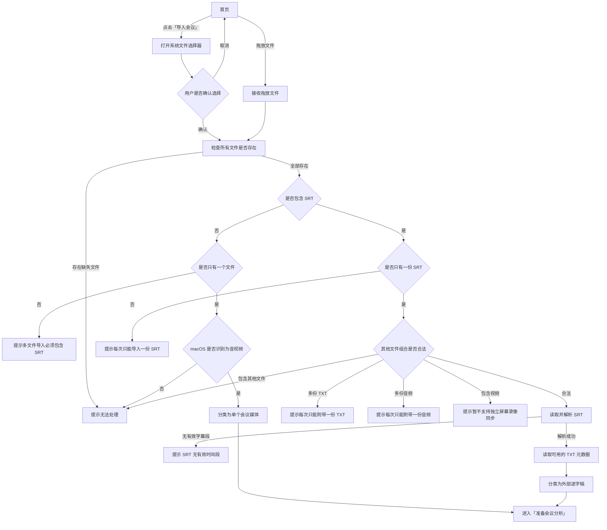
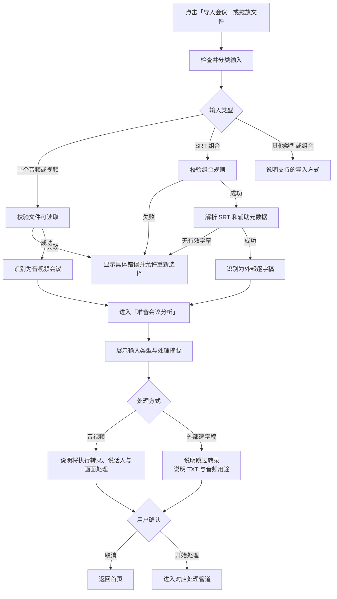

# 首页「导入会议」功能逻辑梳理

> 文档状态：产品梳理稿
> 梳理日期：2026-09-02
> 功能入口：首页 →「导入会议」
> 相关入口：首页文件拖放、系统录屏完成后的文件承接
> 当前阶段：只记录现状、问题与建议，不修改产品代码。

## 1. 功能结论

「导入会议」是首页核心主入口，名称与实际能力基本一致，建议保留。

当前底层分类逻辑较完整，已经能区分：

- 单个会议音频或视频。
- 以 SRT 为主数据的外部逐字稿组合。
- 不受支持的文件和文件组合。

主要问题不在于缺少导入能力，而在于：

- 用户选择文件前不容易理解合法的多文件组合。
- 准备页没有明确说明系统把文件识别成了什么，以及接下来会执行哪些处理。
- 外部逐字稿路径仍展示容易误解的「识别场景」。
- TXT 中的关键词虽然已解析，但没有进入后续业务流程。
- 导入会议与系统录屏等待状态之间缺少互斥逻辑。

## 2. 用户目标

用户希望选择已有的会议录音、录像或外部逐字稿，在系统确认输入有效后补充会议信息并开始生成纪要。

用户不应该需要理解内部的转录、说话人分离和画面识别实现，系统应根据输入自动选择处理路径，并在开始前说明关键差异。

## 3. 功能入口

### 3.1 首页按钮

用户点击「导入会议」，打开 macOS 系统文件选择器。

### 3.2 首页拖放

用户将一个或多个文件拖入首页。拖放与按钮选择最终共用 `MeetingInput.classify` 分类逻辑。

### 3.3 系统录屏承接

「录制会议」检测到系统录屏文件后，也会把文件交给相同的输入分类逻辑。该入口当前仍需用户点击「导入刚录制的文件」。

## 4. 支持的输入类型

### 4.1 单个音视频

一次选择一个被 macOS 识别为音视频的文件。常见格式包括：

- MOV
- MP4
- M4A
- MP3
- WAV
- AAC
- OPUS

成功分类后进入完整媒体处理流程：

- 提取音轨。
- 本地语音转录。
- 按当前能力执行说话人分离和声纹匹配。
- 视频输入执行画面抽取、去重和 OCR。
- 合并逐字稿、屏幕证据和会议材料。
- 调用纪要模型。

### 4.2 外部逐字稿组合

外部逐字稿必须以一份 SRT 为主数据。合法组合包括：

| 组合 | 用途 |
|---|---|
| SRT | 使用已有时间码、发言人和正文生成纪要 |
| SRT + TXT | TXT 补充妙记导出的会议日期、时长和关键词 |
| SRT + 原始音频 | 音频作为关联源文件保留 |
| SRT + TXT + 原始音频 | 同时补充元数据和关联音频 |

外部逐字稿路径会跳过：

- 本地 Whisper 转录。
- 说话人分离。
- 独立视频画面抽取。

### 4.3 当前不支持的输入

- 单独导入 TXT。
- 一次导入多个普通音视频。
- 一次导入多份 SRT。
- 一次附带多份 TXT。
- 一次附带多份原始音频。
- SRT 与独立视频组合。
- 不属于支持类型的其他文件。

## 5. 当前功能逻辑

## 6. 输入分类后的数据使用

### 6.1 单个音视频

- 主文件成为会议源文件。
- 文件名成为准备页的默认会议名称。
- 录制日期优先从文件创建日期推断，缺失时回退到修改日期或导入时间。
- 音频和视频进入正常媒体处理管道。

### 6.2 外部逐字稿

- SRT 成为主源文件。
- SRT 文件名成为准备页的默认会议名称。
- SRT 正文、时间码和发言人直接成为会议逐字稿。
- TXT 中解析出的会议日期会成为会议日期候选。
- TXT 中声明的时长会与 SRT 推算时长取较大值。
- 原始音频和 TXT 会记录为关联源文件。
- TXT 中的关键词已经解析，但当前未发现其进入提示词、标签、背景或其他后续流程。

## 7. 当前做得好的地方

- 按钮选择、拖放和系统录屏承接共用一套分类逻辑。
- 文件在进入准备页前完成存在性和类型校验。
- 外部逐字稿以 SRT 为主数据，避免把没有时间码的 TXT 当作可靠逐字稿。
- SRT 在准备页出现前就完成解析，能够提前发现空字幕或格式不兼容。
- 多份 SRT、TXT 或音频会被明确拒绝，不会静默选择其中一份。
- 暂不支持的 SRT 与独立视频同步会明确拦截。
- 单文件媒体和外部逐字稿共用会议信息准备流程。
- 用户取消系统文件选择器不会留下新的处理中状态。

## 8. 主要问题与风险

### 8.1 文件选择范围与真实规则不完全一致

系统文件选择器允许音视频、纯文本和 SRT，但单独选择 TXT 后会被拒绝。

用户可能把 TXT 理解为可独立导入的逐字稿。建议明确说明：

> 选择一个音频或视频；也可以选择一份 SRT，并同时附带 TXT 和原始音频。TXT 不能单独导入。

### 8.2 多文件组合规则依赖试错

用户只有选错后才会逐步知道：

- 多文件导入必须包含 SRT。
- SRT 只能有一份。
- TXT 和音频最多各一份。
- 视频不能作为 SRT 的配套文件。

第一次导入飞书妙记文件时，理解成本偏高。

### 8.3 准备页没有展示导入识别结果

准备页目前主要展示文件名，没有告诉用户：

- 输入被识别为会议媒体还是外部逐字稿。
- 是否会执行本地语音转录。
- 是否会执行说话人分离。
- 是否会提取视频画面。
- TXT 和原始音频分别会如何使用。

这使得用户无法在开始处理前验证系统理解是否符合预期。

### 8.4 外部逐字稿仍显示「本次识别场景」

外部 SRT 已经跳过语音识别，但准备页仍要求用户看到并可修改「本次识别场景」。

该设置容易让用户误以为 SRT 会被重新识别，建议后续确认：

- 外部逐字稿路径隐藏该设置；或
- 如果该设置对纪要语言处理仍有实际作用，则改成准确的产品名称。

### 8.5 TXT 关键词存在业务断点

代码能够从妙记 TXT 中解析关键词，但当前未发现关键词被用于：

- 纪要生成背景。
- 会议标签。
- 项目匹配。
- 领域词表。
- 历史检索字段。

这与产品说明中“TXT 用于补充日期、时长与关键词”不完全一致。

后续需要在以下方案中选择：

1. 将关键词作为本次分析的补充上下文。
2. 将关键词作为准备页的候选标签，由用户确认。
3. 停止读取和宣传关键词能力。

### 8.6 配套原始音频的用户价值不清晰

外部逐字稿附带原始音频后，不会重新转录，也不会重新执行说话人分离。用户可能误以为系统会使用音频校验或修正 SRT。

建议准备页明确说明：

> 原始音频作为关联来源保留，不会重新识别。

还需要结合历史详情页继续核对原始音频是否能稳定用于回听或打开。

### 8.7 准备页取消后选择结果丢失

用户完成文件选择并进入准备页后，如果点击取消，需要重新选择文件。对单文件影响较小，对 SRT、TXT、音频组合稍显繁琐。

当前不建议立即增加恢复状态，等首页和准备页全部盘点后再统一判断。

### 8.8 与系统录屏等待状态可能冲突

如果 MeetingScribe 正在等待系统录屏，而用户手动导入了另一场会议，原录屏监听可能仍然存在。稍后检测到录屏文件时可能产生陈旧提示。

建议规则：

> 用户通过按钮或拖放成功选择另一场会议时，结束当前系统录屏等待会话。

### 8.9 错误弹窗标题不完全准确

当前统一标题为「无法处理这个文件」，但多文件组合错误并不是某一个文件损坏。

建议改为：

> 无法导入所选文件

具体原因继续放在正文中。

## 9. 推荐功能定义

> 「导入会议」用于选择一份已有的会议音频或视频，或者导入一份以 SRT 为核心的外部逐字稿组合。MeetingScribe 在进入准备页前检查文件和组合，并在准备页说明将采用的处理方式。用户确认会议信息后才开始处理。

## 10. 推荐功能逻辑

## 11. 推荐准备页摘要

### 音视频会议

> 已识别会议录像：`项目双周会.mov`
> 将在本机执行语音转录、说话人处理和屏幕内容提取。

纯音频输入应隐藏屏幕内容提取说明。

### 外部逐字稿

> 已识别外部逐字稿，共 628 个字幕段。
> 将使用 SRT 的时间码和发言人，跳过语音转录与说话人分离。

如果附带 TXT：

> 已读取 TXT 中的会议日期和时长。

如果附带原始音频：

> 原始音频将作为关联来源保留，不会重新识别。

## 12. 状态定义

| 状态 | 用户可见反馈 | 可用操作 | 退出条件 |
|---|---|---|---|
| 首页空闲 | 显示「导入会议」和拖放区域 | 选择文件、拖放文件 | 用户提交文件 |
| 系统选择器打开 | macOS 文件选择界面 | 选择、取消 | 用户确认或取消 |
| 正在校验 | 可短暂显示读取状态 | 暂无 | 分类成功或失败 |
| 校验失败 | 具体错误与支持方式 | 重新选择、返回首页 | 用户选择下一步 |
| 准备会议 | 输入摘要和会议信息表单 | 开始处理、取消 | 用户确认或取消 |
| 处理中 | 对应管道的进度反馈 | 按现有处理逻辑 | 完成、失败或取消 |

## 13. 异常与边界处理

| 场景 | 当前结果 | 推荐规则 |
|---|---|---|
| 用户取消文件选择器 | 返回首页 | 保持现状 |
| 文件不存在或已移动 | 提示缺失 | 保持并允许重新选择 |
| 单独选择 TXT | 提示不支持 | 同时说明 TXT 必须与 SRT 一起导入 |
| 一次选择多个普通媒体 | 提示必须包含 SRT | 说明当前一次只能处理一场媒体会议 |
| SRT 没有有效字幕段 | 拒绝导入 | 保持并提示检查导出格式 |
| SRT 不是 UTF-8 | 可能显示底层读取错误 | 转换为面向用户的编码错误说明 |
| TXT 无法按 UTF-8 读取 | 静默忽略元数据 | 在准备页提示 TXT 未成功读取 |
| SRT 与视频组合 | 拒绝并说明需要同步 | 保持现状 |
| 正在等待系统录屏时导入其他会议 | 录屏监听可能继续 | 成功提交新输入时结束录屏等待 |
| 准备页材料仍在提取 | 禁止开始处理 | 保持现状 |
| 会议名称为空 | 阻止开始 | 保持并把错误显示在名称附近 |

## 14. 文案建议

### 首页说明

当前：

> 拖入录音、录像，或妙记导出的逐字稿

可优化为：

> 拖入一份会议录音或录像，也可导入 SRT 逐字稿

### 文件选择器说明

> 选择一个音频或视频；也可以选择一份 SRT，并同时附带 TXT 和原始音频。TXT 不能单独导入。

### 错误弹窗标题

> 无法导入所选文件

### 多个普通媒体

> 当前一次只能导入一场会议。若要导入外部逐字稿，请选择一份 SRT，并可同时附带一份 TXT 和一份原始音频。

## 15. 优先级建议

### P0：补齐逻辑一致性

- 手动导入或拖放另一场会议时，结束系统录屏等待。
- 明确 TXT 关键词是否进入业务流程。
- 核对外部逐字稿配套音频在历史页中的实际用途。
- 外部逐字稿隐藏无效的识别场景，或修正其产品含义。

### P1：降低理解成本

- 准备页展示输入类型和后续处理摘要。
- 文件选择器明确 TXT 不能单独导入。
- 多文件错误统一使用「无法导入所选文件」。
- 外部逐字稿显示有效字幕段数，以及 TXT 和音频的用途。
- TXT 读取失败时不要静默忽略。

### P2：增强体验与测试

- 评估准备页取消后是否短暂保留最近一次选择。
- 对多文件组合提供更直观的确认方式。
- 补充 `MeetingInput` 文件组合、编码错误和拖放入口测试。

## 16. 验收标准

- 点击「导入会议」能够打开系统文件选择器。
- 拖放和按钮选择使用相同的文件分类规则。
- 单个受支持的音视频能够进入准备页。
- 合法的 SRT、TXT、原始音频组合能够进入准备页。
- 不合法的文件组合不会静默舍弃任何文件。
- 准备页明确展示输入类型和即将执行的处理方式。
- 外部 SRT 路径不会让用户误以为逐字稿将被重新语音识别。
- TXT 元数据读取成功或失败都有可理解的结果。
- 配套音频的用途在开始处理前明确告知用户。
- 用户提交其他会议输入后，系统录屏等待会话不再继续。
- 用户取消系统文件选择器不会留下处理中状态。
- 所有错误均提供重新选择或返回首页的路径。

## 17. 与其他功能的关联

| 关联功能 | 关联点 |
|---|---|
| 录制会议 | 系统录屏结果最终复用导入分类；手动导入应结束录屏等待 |
| 首页拖放 | 与导入按钮共用分类逻辑，文案和错误应保持一致 |
| 准备会议分析 | 需要展示输入类型、处理方式和适用设置 |
| 添加材料 | 会议主输入与辅助材料的文件类型和职责需要明确区分 |
| 处理进度 | 不同输入类型进入不同管道，进度阶段应相符 |
| 历史会议 | SRT、TXT、原始音频的来源关系和后续打开能力需一致 |
| 重新处理 | 外部逐字稿应复用已保存逐字稿，不重新运行转录 |

## 18. 待确认产品决策

1. TXT 关键词用于本次分析背景、候选标签，还是停止读取？
2. 外部逐字稿附带的原始音频是否承诺支持历史回听？
3. 外部逐字稿准备页是否完全隐藏「识别场景」？
4. 准备页取消后是否需要保留最近一次文件选择？
5. 多文件组合是否继续依赖系统多选，还是提供专门的“导入外部逐字稿”入口？
6. 是否需要明确列出官方验证过的媒体格式，而不是依赖 macOS 的泛音视频识别？
