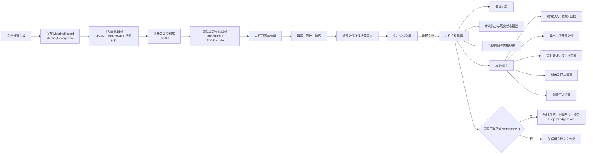
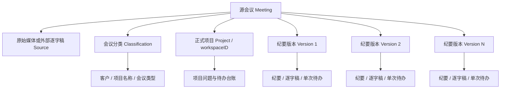

# 「会议资料库」功能逻辑梳理

> 文档状态：产品梳理稿
> 梳理日期：2026-09-04
> 功能范围：会议入库、分类、搜索、版本、详情、编辑、归档、导出、重新处理与删除
> 当前阶段：只记录现状、问题与建议，不修改产品代码。

## 1. 功能结论

「会议资料库」是 MeetingScribe 的本地会议权威记录入口。纪要生成并完成必要的问题确认后，系统会为该次结果建立一条独立记录；资料库不依赖用户后来导出的 Markdown 文件。

当前资料库采用三栏结构：

1. 左栏：智能分类与客户、项目、会议类型分类树。
2. 中栏：会议列表，同一源文件的多个结果折叠为一个会议组。
3. 右栏：纪要、待办、信息和会议操作。

核心复杂性来自四组关系：

- 会议记录与原始媒体。
- 一场源会议与多个纪要版本。
- 客户/项目文字分类与正式项目 ID。
- 单次会议待办与跨会议项目台账。

## 2. 数据来源与存储边界

每条会议记录位于：

```text
~/Library/Application Support/MeetingScribe/Meetings/<会议记录 UUID>/
```

| 内容 | 用途 | 是否内部权威数据 |
|---|---|---:|
| `metadata.json` | 会议信息、分类、模型、状态及关联数据 | 是 |
| `minutes.md` | 当前内部 Markdown 纪要 | 是 |
| `minutes.json` | 结构化纪要；模型回退时可能不存在 | 是 |
| `transcript.json` | 带时间轴逐字稿 | 是 |
| `materials/` | 成功入库后托管的会议材料副本 | 是 |
| 原始音频/视频 | 通常只保存外部路径，不复制文件 | 否 |
| 用户导出的文件 | 独立副本，移动或删除不影响资料库 | 否 |

原始媒体移动后，纪要、结构化数据和逐字稿仍可查看；依赖源媒体的重新转录、重新分离和打开源文件会受影响。

## 3. 资料库加载逻辑

打开资料库时：

1. 枚举会议根目录下的记录目录。
2. 读取各目录的 `metadata.json`。
3. 使用 JSON 解码为 `MeetingRecord`。
4. 检查记录 schema 是否高于当前应用版本。
5. 可读取的记录加入资料库。
6. 无法读取的记录单独列入「无法读取」，不会阻断其他会议加载。
7. 加载正式客户和项目。
8. 恢复上次选择的资料库范围和排序方式。
9. 必要时执行一次存量标题与日期迁移。

主要组件：Foundation 文件系统、`JSONDecoder`、`MeetingHistoryStore`，全程本机执行，不调用模型；只有用户主动执行历史待办回溯时才调用当前配置的模型。

## 4. 总体逻辑图



## 5. 左栏：智能分类

### 最近会议

- 只显示未归档记录。
- 会议日期在最近 30 天内。
- 判断依据是会议发生时间 `createdAt`，不是纪要生成时间。

### 全部会议

- 显示所有未归档记录。

### 待办未完成

- 显示结构化纪要中仍有未关闭待办的会议。
- 这是“包含未完成待办的会议列表”，不是跨会议去重后的项目待办清单。

### 已收藏

- 位于筛选菜单。
- 只显示 `isFavorite == true` 且未归档的记录。

### 已归档

- 位于筛选菜单。
- 只显示已经归档的记录。

### 标签

- 位于筛选菜单。
- 从未归档记录的标签中动态汇总。
- 匹配不区分大小写。

## 6. 左栏：客户、项目和会议类型树

分类树结构为：

```text
客户
└── 项目名称
    └── 会议类型/标签
```

这里主要使用会议记录中的三个文本字段：

- `customerName`
- `projectName`
- `tags`

客户或项目为空时统一显示为「未知」。分类树并不是直接从正式项目结构生成，而是从每个源会议的代表版本汇总文本。

这意味着：

- 即使没有正式项目 ID，会议仍可出现在客户/项目分类树中。
- 即使关联了正式项目 ID，文本写错仍可能出现在另一个分类节点。
- 左栏看起来属于某项目，不代表已经进入该项目台账。

## 7. 正式项目关联

会议记录中的 `workspaceID` 才决定：

- 能否打开对应项目总览。
- 历史问题与待办的检索范围。
- 项目问题关联。
- 项目更新建议归属。
- 项目识别学习。

因此资料库存在两套归属：

| 归属 | 数据来源 | 主要用途 |
|---|---|---|
| 展示分类 | 客户、项目、标签文本 | 左侧树、列表、搜索 |
| 正式项目 | `workspaceID` | 项目总览、问题、待办、学习 |

两者需要建立一致性检查，否则用户看到的分类与后台台账可能属于不同项目。

## 8. 搜索逻辑

搜索框会把输入按空格拆成多个词。每个词都必须在任意一个可搜索字段中找到，属于 AND 组合搜索。

搜索字段包括：

- 会议标题。
- 纪要 Markdown。
- 正式项目名称。
- 客户名称。
- 项目名称文本。
- 标签。
- 已确认说话人姓名。

当前不搜索：

- 完整逐字稿正文。
- 材料正文。
- 源文件名以外的关联文件内容。
- 内部项目台账内容。

## 9. 筛选与排序

筛选顺序：

1. 先应用智能范围、正式项目范围或客户范围。
2. 再应用会议类型、客户文本和项目文本筛选。
3. 再应用搜索词。
4. 最后进行版本折叠和排序。

排序方式：

- 最新优先：按会议发生时间倒序。
- 最早优先：按会议发生时间正序。
- 按名称：按标题本地化排序，同名时最新会议优先。

按时间排序时进一步分为今天、昨天、本周和更早。

## 10. 纪要版本逻辑

每次重新生成或重新处理会建立新的会议记录，不覆盖旧记录。

是否属于同一版本组，当前只取决于规范化后的源文件路径。具有相同源路径的记录被视为同一场源会议的不同版本。

列表默认只显示一个代表版本：

- 通常选择生成时间最新的版本。
- 用户从历史版本菜单选中旧版本后，该旧版本临时代表该组。
- 列表显示版本总数。

版本菜单支持：

- 切换历史版本。
- 保留当前版本并清理其他版本。

清理其他版本会删除对应内部记录和相关待确认项目引用，但不会删除原始媒体。

## 11. 中栏会议列表

每行展示：

- 收藏状态。
- 会议标题。
- 会议日期与时间。
- 会议时长。
- 客户/项目文字分类。
- 最多两个标签及剩余数量。
- 本次会议未完成待办数量。
- 纪要版本数量。
- 是否已有香港繁体邮件草稿。

中栏展示的是会议版本组的代表记录，而不是资料库中所有底层记录。

## 12. 右栏：会议纪要

默认展示面向客户的纪要版本，由 `CustomerMinutesRenderer` 在本机从会议记录渲染。

操作包括：

- 用默认 Markdown 应用打开临时文档。
- 打开会议纪要和邮件版本窗口。
- 导出客户会议纪要。
- 导出内部完整纪要。

内部完整纪要包含更多证据、待核对信息和内部判断，只在「信息」页展开或通过导出菜单获取。

## 13. 右栏：待办

待办页包括两部分。

### 本次会议待办

- 来自本版本结构化纪要。
- 展示任务、责任人、截止时间和状态。
- 支持编辑。
- 编辑后同步更新结构化 JSON 和本会议 Markdown。
- 不直接等于项目台账中的跨会议待办。

### 历史待办状态建议

- 新会议明确提及历史待办状态变化时产生。
- 默认不直接修改历史记录。
- 用户可逐条确认或全部确认。
- 确认后修改目标历史会议中的待办状态，并在来源会议记录中标记建议已应用。

## 14. 右栏：信息

信息页展示：

- 会议名称、时间和时长。
- 客户、项目和会议类型。
- 纪要模板。
- 使用的后端和模型。
- 源文件路径。
- 会前材料名称。
- 画面补充分析统计。
- 估算 Token、输入/输出和模型调用阶段。
- 内部完整纪要。

这些信息主要来自 `MeetingRecord`，不重新读取原始媒体。

## 15. 会议操作

### 编辑会议信息

允许修改：

- 当前版本标题。
- 客户名称。
- 项目名称。
- 标签。
- 正式项目 ID。

客户、项目、标签和正式项目关联会同步写入同一源路径下的所有版本；标题和会议日期当前只更新选中的版本。

### 修改说话人

- 可仅保存姓名与角色到当前记录。
- 也可保存后重新生成纪要。
- 重新生成要求原始源文件仍存在。

### 校正识别并重新生成

- 编辑资料库内保存的逐字稿。
- 使用编辑后的逐字稿直接重新生成纪要。
- 不重新运行 Whisper。

### 打开或重新定位源文件

- 原路径存在时可以打开或重新处理。
- 原路径缺失时允许选择新文件。
- 重新定位会用时长容差校验，并同步更新同组所有版本的源路径。

### 导出

支持分别导出：

- 客户会议纪要。
- 内部完整纪要。
- 逐字稿。
- 全部会议资料，包括结构化 JSON。

导出文件是副本，不再与内部记录同步。

### 收藏与归档

- 收藏和归档状态写在当前会议记录上。
- 不修改原始媒体或导出文件。

### 删除

- 删除当前会议记录的内部 UUID 目录。
- 删除项目台账中指向该记录的待确认引用。
- 不删除原始媒体。
- 不删除用户此前导出的文件。
- 不自动删除同组其他纪要版本。

## 16. 项目总览与历史待办回溯

关联正式项目的会议可以打开项目总览，查看：

- 待确认的问题关联。
- 项目问题档案。
- 项目待办台账。
- 问题专题分析。

历史待办回溯会：

1. 按时间顺序检查项目后续会议。
2. 调用当前配置的大模型分析明确提及的历史待办变化。
3. 生成待确认状态建议。
4. 不直接修改历史待办。

这是资料库中少数会主动消耗模型 Token 的操作。

## 17. 各节点使用的引擎

| 节点 | 引擎/组件 | 位置 | 是否调用模型 |
|---|---|---|---:|
| 资料库界面 | SwiftUI、`MeetingHistoryView` | 本机 | 否 |
| 会议加载与保存 | Foundation、`MeetingHistoryStore` | 本机 | 否 |
| JSON 数据解析 | `JSONDecoder` / `JSONEncoder` | 本机 | 否 |
| 分类、筛选和排序 | `MeetingLibrary` 本地规则 | 本机 | 否 |
| 组合搜索 | `MeetingSearch` 本地字符串匹配 | 本机 | 否 |
| 版本折叠 | 源路径分组、本地 Swift 规则 | 本机 | 否 |
| 客户纪要渲染 | `CustomerMinutesRenderer` | 本机 | 否 |
| 内部纪要渲染 | `StructuredMinutesRenderer` | 本机 | 否 |
| 待办编辑与状态应用 | `MeetingHistoryStore`、`ActionTracking` | 本机 | 否 |
| 项目问题与待办 | `ProjectLedgerStore` | 本机 | 否 |
| 历史待办回溯 | `HistoricalActionReviewService` + 当前配置模型 | CLI 或远程 API | 是 |
| 重新处理 | `PipelineRunner` 及完整处理管道 | 本机与所选模型 | 按处理路径 |
| 导出 | Foundation 文件写入 | 本机 | 否 |

## 18. 主要问题与风险

### 18.1 文本分类与正式项目可能脱节

左栏按客户/项目文本展示，项目总览按 `workspaceID` 工作。用户可能在“客户 A / 项目 B”树中看到会议，但后台正式关联到其他项目或没有正式项目。

这是 P0 级数据理解和台账归属风险。

### 18.2 版本分组完全依赖源路径

同一路径被不同会议重复使用时可能被错误合并；同一源文件移动后重新导入又可能形成不同组。源路径并不是稳定的会议身份。

### 18.3 编辑标题没有同步全部版本

当前编辑会议信息时，客户、项目、标签和 `workspaceID` 会同步同源版本，但标题只修改当前版本。这与“同一源会议统一名称”的产品预期及 README 描述不一致。

### 18.4 收藏和归档是版本级状态

收藏或归档只更新当前底层记录，而列表对用户呈现的是一个折叠后的会议组。归档当前版本后，旧版本可能重新出现在未归档列表；收藏状态也可能随所选版本变化。

产品需要决定收藏和归档作用于“会议”还是“纪要版本”。

### 18.5 分类树代表版本选择可能不稳定

分类树为每个源路径挑选代表记录时使用会议日期，而同一会议的版本通常具有相同会议日期，没有使用生成时间明确选最新版本，结果可能受加载顺序影响。

### 18.6 外部 SRT 原文件丢失后的重新处理被误阻断

外部逐字稿已经完整保存在内部 `transcript.json`，重新生成实际上可以不依赖原始 SRT；但当前界面只有源路径存在时才显示「重新处理」。源文件缺失后反而要求重新定位“原始录音或录像”，文案和逻辑都不适用于 SRT。

### 18.7 删除操作不是原子事务

删除流程先删除会议目录，再清理项目待确认引用。若后一步失败：

- 会议文件已经删除。
- 页面可能提示删除失败并暂时保留列表项。
- 项目引用可能残留。

版本清理也有类似的部分成功风险。

### 18.8 待办有多套状态体系

用户会同时接触：

- 本次会议结构化待办。
- 历史会议待办状态建议。
- 项目待办台账。
- 项目问题关联建议。

它们的修改范围和确认方式不同，但界面没有完整解释相互关系。

### 18.9 “完成”记录可能没有结构化能力

模型输出无法解析为结构化 JSON 时，会议仍会入库并显示原文纪要，但不会有结构化待办、问题跟踪和 JSON 导出。列表没有明显区分这种降级记录。

### 18.10 搜索不包含逐字稿

用户可能自然预期资料库搜索会覆盖“某人在会上说过的话”，但当前搜索只覆盖标题、纪要、分类、标签和说话人，不搜索逐字稿正文。

### 18.11 重新定位仅按时长校验

时长差在 `max(10 秒, 原时长 8%)` 内就被接受，可能错误关联长度相近的其他会议。缺少文件哈希、音频指纹或其他身份校验。

## 19. 推荐统一对象模型

建议明确区分：



推荐规则：

- 标题、客户、项目、会议类型、收藏和归档属于源会议。
- 纪要、结构化结果、模型、生成时间属于纪要版本。
- 正式项目 ID 属于源会议，并明确展示。
- 单次待办属于纪要版本。
- 跨会议问题和待办属于正式项目台账。

## 20. 推荐资料库逻辑

1. 以稳定 `meetingID` 表示一场源会议，不再只靠路径分组。
2. 一场会议下面保存多个 `versionID`。
3. 分类、收藏、归档和源文件关联统一保存在会议层。
4. 列表始终展示会议层信息和当前主版本。
5. 版本菜单只切换纪要内容，不改变会议分类状态。
6. 显式展示正式项目关联状态。
7. 项目台账入口说明其与本次会议待办的差异。
8. 内部保存、原始媒体和外部导出分别显示状态。

## 21. 优先级建议

### P0：对象归属与数据一致性

- 统一文本分类和正式项目关联，并检测不一致。
- 明确收藏、归档和会议名称作用于会议还是版本。
- 修复标题只更新当前版本的问题，或修正文案与产品预期。
- 修复外部 SRT 源文件丢失后无法利用内部逐字稿重新生成的问题。
- 删除会议与清理项目引用采用可恢复或可重试策略。

### P1：版本与状态表达

- 建立稳定会议 ID 与独立版本 ID。
- 分类树明确选用最新生成版本。
- 对无结构化结果的会议显示降级状态。
- 解释会议待办、历史建议和项目台账之间的关系。
- 重新定位源文件时加强身份验证。

### P2：检索与体验

- 评估将逐字稿正文加入搜索。
- 提供来源状态：存在、已移动、已重新关联。
- 统一“纪要”“内部纪要”“会议纪要版本”等名称。
- 记录编辑、状态确认和删除的变更历史。

## 22. 验收标准

- 资料库内部记录不依赖外部导出文件。
- 原始媒体丢失后，已有纪要和逐字稿仍可查看。
- 左侧分类与正式项目关联状态对用户可解释。
- 一场会议的多个版本不会因为收藏或归档单个版本而重新出现在错误范围。
- 编辑会议级信息后，所有版本显示一致。
- 切换纪要版本不改变会议级分类和状态。
- 外部逐字稿可使用内部保存的逐字稿重新生成。
- 删除记录不会让项目台账留下不可解释的悬空引用。
- 无法读取的单条记录不会阻断整个资料库。
- 搜索范围有明确说明。
- 导出副本与内部权威记录边界清楚。
- 项目待办与单次会议待办的修改范围清楚。

## 23. 待确认产品决策

1. 资料库的一行代表“源会议”还是“一个纪要版本”？
2. 收藏和归档应作用于整场会议还是单个版本？
3. 编辑会议名称是否必须同步全部版本？
4. 客户/项目分类是否必须绑定正式项目，还是继续允许纯文本分类？
5. 未绑定正式项目的会议是否允许生成项目问题与待办建议？
6. 逐字稿是否纳入全文搜索？
7. 原始媒体丢失后，哪些操作仍应可用？
8. 删除一场会议时，是否同时删除所有纪要版本？
9. 是否需要为项目待办、会议待办和历史状态建议建立统一入口？
