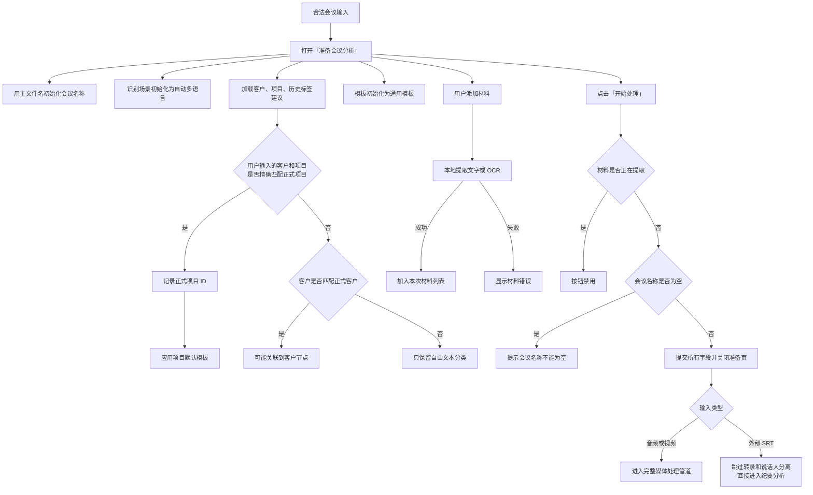
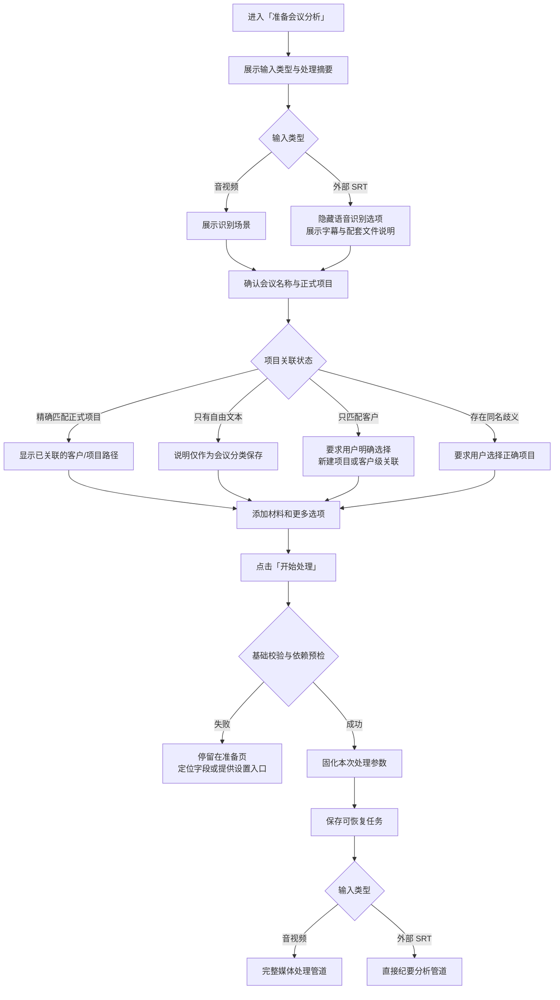

# 「准备会议分析」与「开始处理」功能逻辑梳理

> 文档状态：产品梳理稿
> 梳理日期：2026-09-02
> 功能范围：导入文件成功 → 填写会议信息 → 点击「开始处理」→ 进入处理管道
> 当前阶段：只记录现状、问题与建议，不修改产品代码。

## 1. 功能结论

「准备会议分析」承担两个职责：

1. 让用户确认本次会议的名称、识别方式、客户、项目、会议类型、材料、模板和背景。
2. 把本次输入解析成完整的会议处理参数，并决定后续是否关联正式项目及项目台账。

当前页面能够完成处理前配置，但存在三个核心问题：

- 页面没有根据“音视频”与“外部逐字稿”区分有效字段。
- 客户、项目既是自由文本，又隐式承担正式项目关联，用户不容易理解数据影响范围。
- 点击「开始处理」前只校验会议名称和材料提取状态，没有预检文件、AI、转录模型等关键依赖。

其中项目关联风险最高：正式项目 ID 会影响项目背景、识别学习、历史问题、历史待办和项目更新建议，不能只作为一个普通文本输入处理。

## 2. 页面进入条件

用户通过以下任一入口提交合法会议输入后进入本页：

- 首页「导入会议」。
- 首页拖放音视频或外部逐字稿组合。
- 「录制会议」检测到系统录屏后导入。

进入页面前已经完成：

- 文件存在性检查。
- 单个媒体或外部逐字稿分类。
- SRT 组合合法性检查。
- 外部 SRT 基础解析。

进入页面时还没有开始：

- 音频提取。
- 语音转录。
- 说话人分离。
- 画面抽取与 OCR。
- 大模型纪要生成。

## 3. 页面字段与实际作用

| 字段/操作 | 初始值 | 是否必填 | 实际作用 |
|---|---|---:|---|
| 会议名称 | 主输入文件名去掉扩展名 | 是 | 历史会议标题候选、纪要提示信息；生成后可能被模型标题优化 |
| 本次识别场景 | 自动多语言 | 否 | 音视频的 Whisper 语言、转录提示和缓存身份；外部 SRT 不重新转录 |
| 客户 | 空；提供历史建议 | 否 | 历史分类字段；还参与正式项目解析 |
| 项目名称 | 空；按客户提供建议 | 否 | 历史分类字段；还参与正式项目解析和项目台账关联 |
| 会议类型/标签 | 空；提供历史建议 | 否 | 进入纪要提示词、历史分类和搜索 |
| 新建项目 | 默认收起 | 否 | 创建正式客户和项目，并选中该项目 |
| 本次会议材料 | 空 | 否 | 本地提取文字/OCR，参与转录提示和纪要事实来源，成功后托管到历史目录 |
| 纪要模板 | 通用模板；匹配项目后改为项目默认模板 | 否 | 决定纪要结构和要求 |
| 本次背景 | 空 | 否 | 参与识别学习上下文和纪要提示词，仅用于本次会议 |

## 4. 字段联动逻辑

### 4.1 会议名称

- 默认使用主输入文件名。
- 用户可以修改。
- 点击「开始处理」时去除首尾空白。
- 为空时阻止处理。
- 纪要生成后，如果名称仍近似源文件名，系统可能用结构化纪要标题进行优化。

### 4.2 客户与项目名称

客户和项目名称使用可自由输入、带历史建议的文本字段。

当文本变化时，系统尝试查找正式项目：

- 客户名称与已有客户完全匹配。
- 项目名称与该客户下已有项目完全匹配。
- 匹配成功后，内部保存正式项目 ID。
- 正式项目变化后，自动应用项目默认纪要模板。

如果项目名称未匹配正式项目、但客户名称匹配正式客户，系统可能退回关联客户节点。

### 4.3 新建项目

用户可以在准备页直接：

1. 选择已有客户，或输入新客户名称。
2. 输入项目名称。
3. 输入长期背景。
4. 点击「创建并选择」。

保存成功后：

- 新项目成为当前正式项目。
- 客户和项目名称自动回填。
- 项目默认模板开始生效。
- 长期背景可用于当前及后续会议。

### 4.4 会议类型/标签

- 用户可自由输入多个标签。
- 建议来自历史会议。
- 点击开始时统一解析、去重和清理。
- 标签进入纪要提示词。
- 标签还用于资料库会议类型和搜索。

当前标签位于默认表单，但产品简化文档曾计划把处理前标签收入「更多选项」或生成后整理，现状与目标方向需要统一。

### 4.5 本次会议材料

支持：

- PDF
- TXT、Markdown、CSV、JSON
- PNG、JPEG

材料添加后立即在本机提取：

- 文本文件直接读取。
- PDF 提取文字。
- 图片执行本地 OCR，并按情况保留 JPEG 数据。

限制：

- 最多 12 份材料。
- 单份最多提取 15,000 字。
- 当前准备页累计最多 24,000 字。
- 超过累计限制的最后一份材料会被截断。
- 材料提取期间「开始处理」被禁用。

材料实际影响：

- 前三份材料的少量文字会进入转录初始提示，帮助识别人名和术语。
- 所有已添加材料作为独立事实来源进入纪要提示。
- 成功保存历史会议时，材料原件会复制到会议内部目录。

### 4.6 纪要模板

- 初始使用通用模板。
- 匹配或新建正式项目后，自动切换为项目默认模板。
- 用户可在本次会议中临时修改。
- 本次选择不会修改项目默认模板。

### 4.7 本次背景

- 只用于本次会议。
- 进入纪要提示词。
- 对音视频会议，还与项目名称、项目长期背景和部分材料共同用于项目识别学习及术语提示。
- 不会反向写入项目长期背景。

## 5. 客户、项目与正式项目 ID 的区别

这是本页最需要向用户解释的逻辑。

### 5.1 自由文本字段

客户和项目名称即使没有匹配正式项目，也会保存到会议记录，用于：

- 历史资料库分类。
- 搜索。
- 会议信息展示。

### 5.2 正式项目 ID

只有解析到已有项目、已有客户节点或刚创建的项目时，才会保存正式项目 ID。

正式项目 ID 会进一步影响：

- 项目长期背景。
- 项目默认纪要模板。
- 项目识别学习和术语记忆。
- 历史会议范围。
- 历史待办与状态建议。
- 项目问题关联。
- 项目台账更新建议。

因此，“显示为某个项目”和“真正关联到正式项目”不是同一件事。

## 6. 当前「开始处理」逻辑

点击「开始处理」时依次发生：

1. 解析会议类型/标签。
2. 清理会议名称首尾空白。
3. 检查会议名称是否为空。
4. 将本次背景清理首尾空白。
5. 解析正式项目：优先使用已选项目 ID，再按客户和项目名称匹配，最后可能退回客户节点。
6. 把会议名称、识别场景、项目、背景、模板、客户、项目名称、标签和材料提交给首页。
7. 关闭准备页。
8. 根据输入类型进入不同处理管道。

当前开始前不会主动检查：

- 音视频是否真的包含音轨。
- Whisper、转录模型和 VAD 是否就绪。
- AI 后端是否可以调用。
- 源文件在准备期间是否被移动或删除。
- 预计处理时间、文件大小或磁盘空间。

## 7. 当前功能逻辑图

## 8. 音视频处理路径

点击开始后，音视频依次执行：

1. 保存未完成任务信息，用于异常退出恢复。
2. 探测媒体文件。
3. 检查是否包含音轨。
4. 根据文件、识别场景和提示词查找转录缓存。
5. 必要时提取 WAV 音频。
6. 必要时执行 Whisper 转录。
7. 应用项目识别记忆。
8. 说话人环境可用时执行或复用说话人分离。
9. 视频且画面识别未关闭时抽取画面并 OCR。
10. 合并逐字稿、画面、材料、项目背景、标签和模板。
11. 调用模型生成结构化纪要。
12. 必要时进入问题边界确认。
13. 保存历史会议、托管材料并生成项目更新建议。

处理失败时：

- 转录或媒体处理失败：进入失败页。
- 说话人分离失败：降级继续，纪要不含说话人信息。
- 模型失败但逐字稿已完成：保留处理结果，可只重试纪要生成。

## 9. 外部逐字稿处理路径

点击开始后，外部逐字稿：

1. 直接读取准备页打开前已解析的 SRT。
2. 使用 SRT 时长与 TXT 声明时长的较大值。
3. 使用 TXT 日期，缺失时从 SRT 文件时间推断。
4. 将 SRT、TXT 和原始音频记录为相关来源。
5. 跳过 Whisper 转录。
6. 跳过说话人分离。
7. 不提取独立视频画面。
8. 合并逐字稿、材料、项目背景、标签和模板。
9. 调用模型生成结构化纪要。
10. 必要时进入问题边界确认。
11. 保存历史会议、托管材料并生成项目更新建议。

当前外部逐字稿路径没有像音视频路径一样保存未完成任务。若应用在纪要生成过程中退出，恢复能力可能不一致。

## 10. 主要问题与风险

### 10.1 正式项目关联过于隐式

用户看到的是自由文本建议字段，但背后可能写入正式项目 ID，并影响整个项目的学习、待办和问题台账。

建议后续把状态明确展示为：

- 已关联项目：客户 A / 项目 B。
- 尚未关联正式项目，仅保存为会议分类。
- 已关联客户，但项目尚未创建。

### 10.2 项目名称可能匹配到错误客户

项目解析逻辑在没有找到匹配客户时，仍可能仅按项目名称匹配任意客户下的同名项目。

以下场景存在风险：

- 客户名称为空，项目名称与多个客户下项目同名。
- 客户名称输入错误，但项目名称碰巧匹配其他客户。
- 历史数据中存在同名项目。

结果可能是页面显示的客户/项目文本与内部正式项目 ID 不一致，进而让识别学习和项目台账关联错误。

这是 P0 级数据归属风险。

### 10.3 未建项目可能退回客户级关联

用户输入了一个尚未创建的项目名称，但客户匹配成功时，会议可能关联到客户节点。页面虽然有说明，但“问题关联仍会正常生成”可能让用户误以为已经建立了独立项目。

客户级关联可能把多个未建项目的问题和待办混在同一客户范围，需要重新确认产品规则。

### 10.4 客户和项目文本没有统一清理

会议名称和本次背景在提交时会去除首尾空白，但客户名称和项目名称直接传入会议记录。解析正式项目时会临时清理，最终保存的展示文本仍可能保留多余空格。

### 10.5 外部逐字稿展示无效识别选项

外部 SRT 不执行语音识别，但页面仍显示「本次识别场景」。用户无法判断它是否会修改已有逐字稿。

### 10.6 缺少处理前关键预检

点击开始时只校验会议名称。其他问题要等准备页关闭后才暴露，例如：

- 音视频没有音轨。
- 转录工具或模型缺失。
- AI 服务未配置。
- 源文件已移动。

这会让用户填写完信息后立即进入失败页。

### 10.7 外部逐字稿缺少异常退出恢复

音视频开始时会保存待恢复任务；外部逐字稿当前没有建立同等的待恢复任务。两类导入的可靠性不一致。

### 10.8 材料截断提示不足

累计材料超过 24,000 字时，后添加材料可能被截断，但列表只展示最终字数，没有明确提示该材料内容不完整。

### 10.9 材料数量检查时机偏晚

添加材料时会先执行提取，再检查是否超过 12 份。用户已满 12 份后继续添加，系统仍可能先花时间解析文件，然后才提示达到上限。

### 10.10 新建项目失败后的临时状态

新客户和项目会先加入页面内存，再尝试保存。保存失败后，内存中的临时对象仍可能保留，用户重试可能产生重复或状态混乱。

### 10.11 页面默认信息密度与简化方向不完全一致

当前默认展示：

- 会议名称。
- 识别场景。
- 客户。
- 项目名称。
- 会议类型/标签。
- 材料。

而产品简化方向曾提出默认保留会议名称、项目、材料和开始处理，将标签收入更多选项。需要在整体盘点后统一决定。

## 11. 推荐功能定义

> 「准备会议分析」用于确认本次会议的基本身份、正式项目归属和分析来源。系统应根据输入类型只展示有效设置，明确区分“会议分类文本”和“正式项目关联”，并在关键依赖可用后才允许开始处理。

## 12. 推荐页面信息层级

### 默认展示

- 输入摘要：音视频或外部逐字稿，以及将执行的处理方式。
- 会议名称。
- 正式项目选择。
- 本次会议材料。
- 「开始处理」。

### 按条件展示

- 音视频：识别场景。
- 外部逐字稿：字幕段数、TXT 和原始音频用途。
- 未匹配正式项目：显示“仅保存分类，不进入项目台账”。
- 匹配正式客户但项目未建立：提示选择新建项目或明确使用客户级归属。

### 更多选项

- 本次背景。
- 纪要模板。
- 会议类型/标签。

## 13. 推荐功能逻辑图

## 14. 「开始处理」推荐校验

### 所有输入

- 会议名称非空。
- 主输入仍存在且可读取。
- AI 后端达到可调用的基础条件。
- 项目关联不存在歧义。
- 材料提取已经完成。
- 材料数量和总量状态清晰。

### 音视频输入

- 媒体包含有效音轨。
- Whisper 和主模型已安装，或存在可复用转录缓存。
- VAD 模型状态符合实际必需规则。

### 外部逐字稿

- SRT 仍存在且解析结果可用。
- 不要求 Whisper 和说话人环境。
- TXT 读取失败时明确告知，但不应阻断有效 SRT。

预检失败应尽可能停留在准备页，保留用户已经填写的内容。

## 15. 状态与数据影响

| 用户动作 | 当前会议 | 正式项目 | 历史资料库 | 项目台账 |
|---|---|---|---|---|
| 修改会议名称 | 修改本次标题候选 | 无 | 成功后保存 | 无直接影响 |
| 输入客户/项目自由文本 | 保存分类文本 | 可能隐式解析 | 用于分类和搜索 | 解析到 ID 时可能影响 |
| 选择正式项目 | 保存项目 ID | 使用背景和默认模板 | 归入项目范围 | 生成该项目的更新建议 |
| 新建项目 | 当前会议选中 | 新增正式客户/项目 | 后续可复用 | 建立独立台账范围 |
| 添加标签 | 保存到会议 | 无 | 用于类型、搜索 | 进入纪要提示但不决定台账归属 |
| 添加材料 | 用于本次分析 | 不写入项目长期资料 | 成功后托管副本 | 可成为纪要与建议证据来源 |
| 修改本次背景 | 用于本次提示 | 不修改长期背景 | 保存到本次会议 | 间接影响模型输出 |
| 修改模板 | 改变本次纪要结构 | 不修改默认模板 | 保存本次选择 | 间接影响结构化结果 |

## 16. 优先级建议

### P0：数据归属与恢复

- 禁止客户未匹配时仅按项目名称关联任意客户下的项目。
- 同名项目存在歧义时要求用户明确选择。
- 明确客户级关联与项目级关联的差异。
- 外部逐字稿补齐与音视频一致的未完成任务恢复策略。
- 提交前统一清理客户和项目文本。

### P1：处理前解释和预检

- 展示输入类型和处理摘要。
- 外部逐字稿隐藏无效识别场景。
- 明确展示正式项目关联状态。
- 点击开始前预检主文件、音轨、转录能力和 AI 基础配置。
- 预检失败时保留准备页已填写内容。

### P2：材料和界面简化

- 满 12 份材料后直接禁止继续选择。
- 明确标记被截断的材料。
- 修复新建项目保存失败后的临时状态。
- 将标签、模板和本次背景按最终产品方向统一收纳。

## 17. 验收标准

- 准备页明确显示当前输入类型和即将执行的处理路径。
- 音视频和外部逐字稿只展示真正有效的设置。
- 会议名称为空时无法开始，错误出现在相关字段附近。
- 客户和项目文本在保存前统一清理。
- 正式项目关联状态对用户可见。
- 客户不匹配时不会仅凭同名项目关联到其他客户。
- 同名项目存在歧义时不会静默选择。
- 未关联正式项目时明确说明不会进入独立项目台账。
- 材料提取期间不能开始处理。
- 材料达到数量或文字上限时明确反馈。
- 关键依赖缺失时优先停留在准备页处理。
- 音视频与外部逐字稿都具备一致、可解释的异常退出恢复策略。
- 点击开始后固化本次参数，后续重试不会意外改用其他项目或模板。

## 18. 与其他功能的关联

| 关联功能 | 关联点 |
|---|---|
| 导入会议 | 输入分类决定准备页字段和处理管道 |
| 录制会议 | 系统录屏进入同一准备页 |
| 项目管理 | 正式项目、长期背景和默认模板来源 |
| 识别学习 | 正式项目 ID、背景和材料影响术语提示 |
| 处理进度 | 开始处理后展示不同管道阶段 |
| 历史会议 | 所有字段最终保存为会议记录 |
| 项目待办 | 正式项目 ID 决定历史范围和更新建议归属 |
| 存储管理 | 材料在成功后托管，失败前仍引用外部文件 |
| 异常退出恢复 | 音视频已支持，外部逐字稿仍需统一 |

## 19. 待确认产品决策

1. 客户和项目是否继续采用自由文本，还是改为明确的正式项目选择器？
2. 输入未创建项目名称时，是否允许退回客户级台账？
3. 未关联正式项目的会议是否完全不生成项目问题和待办建议？
4. 「会议类型/标签」保留在默认区域，还是移动到更多选项或生成后整理？
5. 外部逐字稿是否完全隐藏「识别场景」？
6. AI、Whisper 和音轨预检失败时，是否应阻止关闭准备页？
7. 材料被截断时允许继续处理，还是要求用户确认？
8. 新建项目是否继续内嵌在准备页，还是使用独立轻量弹窗？
