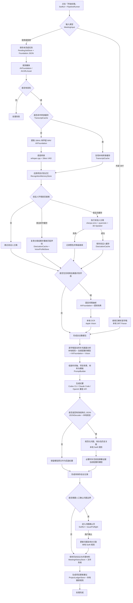
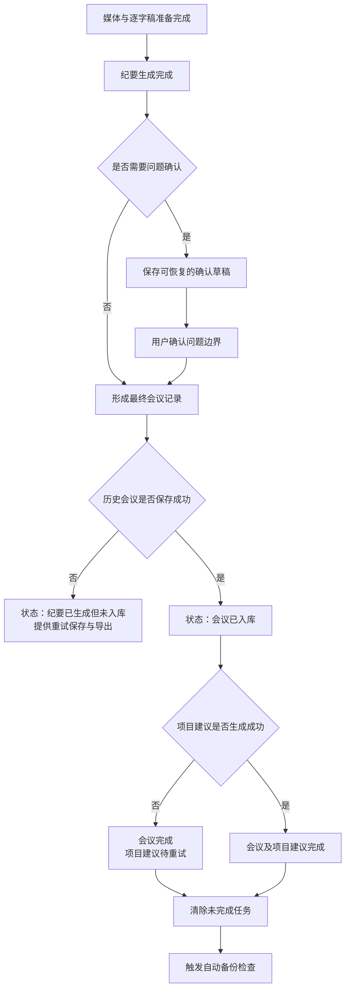

# 「开始处理」到「处理完成」机制逻辑梳理

> 文档状态：产品梳理稿
> 梳理日期：2026-09-02
> 功能范围：点击「开始处理」后，到纪要完成、历史保存和项目建议生成为止
> 当前阶段：只记录现状、问题与建议，不修改产品代码。

## 1. 功能结论

MeetingScribe 的处理机制不是单纯“转录后调用一次模型”，而是包含：

- 媒体探测与音轨提取。
- 转录和说话人缓存复用。
- 本地 Whisper 转录。
- 说话人分离与声纹匹配。
- 固定间隔画面抽取、去重和 OCR。
- 根据逐字稿补看关键画面。
- 结构化纪要生成及屏幕证据补充校验。
- 问题、待办与历史会议关联。
- 必要时人工确认问题边界。
- 历史保存、材料托管和项目更新建议生成。

整体机制完整，并且已经具备缓存、降级和模型重试能力。当前主要缺口集中在：

- 进度轨迹不能正确表达被跳过的阶段。
- 部分取消信号可能被非致命画面逻辑吞掉。
- “确认问题边界”阶段退出后可能无法恢复。
- 历史保存成功、项目建议生成失败时，错误信息不准确。
- 外部逐字稿与音视频的异常退出恢复机制不一致。

## 2. 两条处理主路径

### 2.1 音频或视频

执行完整媒体处理管道：

1. 建立未完成任务记录。
2. 探测文件时长、音轨和画面。
3. 检查并复用转录缓存。
4. 检查并复用说话人缓存。
5. 必要时提取音频。
6. 必要时运行 Whisper。
7. 必要时运行说话人分离。
8. 视频输入抽取和识别屏幕画面。
9. 生成纪要。
10. 保存历史与项目建议。

### 2.2 外部 SRT 逐字稿

跳过媒体处理：

1. 使用准备页之前已解析的 SRT。
2. 建立会议处理数据包。
3. 跳过音频提取、Whisper 和说话人分离。
4. 不提取独立视频画面。
5. 直接生成纪要。
6. 保存历史与项目建议。

当前外部 SRT 路径不建立未完成任务记录。

## 3. 处理状态

代码中定义的状态包括：

| 状态 | 用户文案 | 实际含义 |
|---|---|---|
| `probing` | 读取文件 | 探测媒体或读取外部逐字稿 |
| `extractingAudio` | 提取音轨 | 把媒体音轨混合并转换为 16 kHz 单声道 WAV |
| `transcribing` | 语音转录 | 复用转录缓存或运行 Whisper |
| `separatingSpeakers` | 分离说话人 | 运行本地说话人分离或复用缓存 |
| `extractingFrames` | 提取画面 | 按密度抽帧并使用感知哈希去重 |
| `readingScreen` | 识别屏幕文字 | 对保留画面执行本地 OCR |
| `analyzing` | 生成纪要 | 补充画面、调用模型、整理结构化结果 |
| `reviewingIssues` | 确认问题边界 | 用户人工整理模型识别的问题 |
| `done` | 完成 | 纪要已经生成，并已尝试保存历史和项目建议 |
| `failed` | 失败 | 某个不可降级阶段失败 |

## 4. 当前总体逻辑图

### 4.1 节点与执行引擎对照

| 机制节点 | 主要引擎/组件 | 执行位置 | 是否调用大模型 |
|---|---|---|---:|
| 流程调度与状态切换 | Swift Concurrency、`PipelineRunner` | 本机 | 否 |
| 未完成任务记录 | Foundation JSON、`PendingJobStore` | 本机文件系统 | 否 |
| 媒体探测 | AVFoundation、`AVURLAsset` | 本机 | 否 |
| 多音轨混合与 WAV 提取 | AVFoundation、`AVAssetReader`、`AVAssetWriter` | 本机 | 否 |
| 语音活动检测 | Silero VAD（由 whisper.cpp 调用） | 本机 | 否 |
| 语音转录 | whisper.cpp | 本机 | 否 |
| 转录缓存 | `TranscriptCache` | 本机文件系统 | 否 |
| 项目识别学习 | `RecognitionMemoryStore` 本地规则 | 本机 | 否 |
| 说话人分离 | sherpa-onnx、pyannote 分段模型、3D-Speaker CAMPPlus | 本机 | 否 |
| 声纹姓名匹配 | `VoiceProfileStore` | 本机 | 否 |
| 视频抽帧 | AVFoundation、`AVAssetImageGenerator` | 本机 | 否 |
| 画面去重 | MeetingScribe 感知哈希规则 | 本机 | 否 |
| 屏幕与图片文字识别 | Apple Vision OCR | 本机 | 否 |
| 补充画面候选预筛 | `AdaptiveFramePlanner` 本地规则 | 本机 | 否 |
| 补充画面节点规划 | 当前配置的模型，经 `ModelTextClient` | 本机 CLI 或远程 API | 是，按条件 |
| 提示词与时间轴组装 | `PromptBuilder` | 本机 | 否 |
| 主纪要生成 | Codex CLI、Claude Code 或 OpenAI 兼容 API | 本机 CLI 或远程 API | 是 |
| 结构化 JSON 解析 | Foundation `JSONDecoder`、本地校验 | 本机 | 否 |
| Markdown 渲染 | `StructuredMinutesRenderer` | 本机 | 否 |
| 屏幕证据修复 | 当前配置的模型，经 `ModelTextClient` | 本机 CLI 或远程 API | 是，按条件 |
| 问题风险判断 | `IssuePreflight` 本地规则 | 本机 | 否 |
| 历史问题与待办关联 | `IssueTracking`、`ActionTracking` | 本机 | 否 |
| 人工问题确认 | SwiftUI | 本机 | 否 |
| 历史会议与材料保存 | `MeetingHistoryStore`、Foundation 文件系统 | 本机 | 否 |
| 项目更新建议 | `ProjectLedgerStore` | 本机 | 否 |
| 自动备份检查 | `AutomaticBackupManager` | 本机/用户指定目录 | 否 |

说明：这里的“当前配置的模型”沿用设置中的统一 AI 后端，可能是本机 Codex CLI、本机 Claude Code，或远程 OpenAI 兼容 API；并不是另一个固定模型。

## 5. 阶段一：建立未完成任务

音视频开始处理时，会在应用支持目录保存一份待恢复记录，包括：

- 源文件路径。
- 会议名称。
- 本次背景。
- 纪要模板。
- 识别场景。
- 正式项目 ID。
- 客户和项目名称。
- 标签。
- 材料源文件路径。

如果应用异常退出，下次启动会提示继续处理，并尝试复用已完成的缓存。

当前限制：

- 只保存一份待处理任务，同时开始其他任务会覆盖或替换语义。
- 外部 SRT 路径没有建立同等记录。
- 恢复依赖源文件和材料仍位于原路径。
- 恢复不会保存当时已经生成但尚未最终确认的问题草稿。

## 6. 阶段二：媒体探测

音视频首先通过 AVFoundation 读取：

- 会议时长。
- 是否包含视频轨。
- 是否包含音频轨。

没有音轨时立即失败，因为当前产品无法仅依靠屏幕画面生成会议纪要。

用户可见反馈示例：

> 时长 01:12:30，含画面

## 7. 阶段三：缓存判断

### 7.1 转录缓存

缓存身份由以下因素共同决定：

- 源媒体身份。
- 识别语言。
- 转录提示内容。
- 缓存版本。

转录提示又可能包含：

- 项目识别学习结果。
- 全局领域词表。
- 前三份材料的少量内容。
- 识别场景提示。

因此，识别场景、词表、材料和学习结果变化时，可能无法复用旧转录缓存。这能避免错误复用，但也意味着仅修改会前材料可能触发重新转录。

### 7.2 说话人缓存

只有说话人环境就绪时才使用说话人缓存。缓存与源媒体、指定人数和分离版本有关。

读取缓存后会重新执行声纹姓名匹配，因此：

- 新登记声纹可以立即影响旧缓存。
- 声纹改名或删除不要求重新分离。

## 8. 阶段四：音轨提取

只有以下情况需要提取音轨：

- 没有可用转录缓存；或
- 说话人环境已就绪，但没有可用说话人缓存。

系统会：

- 读取媒体中的所有音频轨。
- 将系统声音与麦克风等多轨混合。
- 转换为 Whisper 使用的 16 kHz、单声道、16 位 PCM WAV。
- 写入临时工作目录。

处理结束后默认删除临时文件；高级设置开启保留中间文件时除外。

## 9. 阶段五：语音转录

没有命中缓存时，本地 Whisper 执行转录：

- 根据识别场景决定语言参数。
- 注入领域词表、项目识别记忆、材料术语和场景提示。
- 使用 VAD 降低静音幻觉并缩短处理时间。
- 按已转录时间更新进度。
- 完成后应用项目识别纠错记忆。
- 将结果写入转录缓存。

如果没有识别到任何有效语音，处理失败，不调用纪要模型。

## 10. 阶段六：说话人分离

说话人环境就绪时：

- 优先复用说话人缓存。
- 无缓存时执行本地说话人分离。
- 默认自动判断人数，也可以在重新处理时指定人数。
- 分离完成后进行声纹姓名匹配。

说话人分离被视为增强能力：

- 失败不会让整场会议失败。
- 系统记录警告。
- 后续继续生成不含可靠说话人信息的纪要。

这是合理的降级策略。

## 11. 阶段七：常规画面处理

仅在以下条件同时满足时执行：

- 输入包含视频轨。
- 设置中的画面密度没有关闭。

流程：

1. 按固定时间间隔取样。
2. 将画面缩放到最大约 1600 × 1600。
3. 计算感知哈希。
4. 相似画面只延长停留时长，不重复保留。
5. 候选超过上限时优先保留停留更久的画面。
6. 使用 Vision 在本机进行 OCR。

当前常规抽帧失败会让整个处理失败；OCR 接口本身采用尽力而为方式。是否允许画面处理失败后降级到纯逐字稿，需要作为产品规则确认。

## 12. 阶段八：逐字稿驱动的补充画面

在进入主纪要生成前，视频会议还会进行第二轮画面检查：

1. 本地从逐字稿中找出可能需要屏幕补证的片段。
2. 关注指代词、数字、日期、版本、告警、日志、架构和演示结果。
3. 让模型从候选片段中最多选择 6 个关键节点。
4. 在节点前、当时、节点后最多补抽 18 帧。
5. 对补充画面执行 OCR。
6. 去掉与既有画面过于相似、且没有新文字的画面。
7. 将有效补充画面加入会议数据包。

这一步属于增强能力：

- 规划失败不阻断纪要。
- 补抽或 OCR 失败不阻断纪要。
- 会回退到常规抽帧结果。

但它可能额外调用一次模型，用户在成本和阶段认知上不容易察觉。

## 13. 阶段九：组装模型上下文

主纪要模型收到的上下文可能包括：

- 会议名称和时长。
- 识别场景的分析指导。
- 正式项目长期背景。
- 本次会议背景。
- 项目历史未完成待办。
- 项目历史问题。
- 本次纪要模板。
- 全局纪要附加要求。
- 会议标签。
- 会前材料文字及材料图片。
- 带时间码的逐字稿。
- 说话人信息。
- 常规和补充屏幕 OCR。
- 支持视觉的模型所接收的筛选后屏幕图片。

Codex CLI 和 Claude Code 路径只接收文字，屏幕画面通过 OCR 表达；支持视觉的 API 后端可以接收筛选后的图片。

## 14. 阶段十：主纪要生成

根据设置选择：

- 本机 Codex CLI。
- 本机 Claude Code。
- OpenAI 兼容 API。

模型优先返回结构化 JSON。系统会：

- 解析并校验结构化结果。
- 规范化模型输出的待办状态。
- 在本地渲染 Markdown。

如果模型返回内容有用但不是合法结构化 JSON：

- 不让本次生成失败。
- 保留模型原文作为纪要。
- 标记“纪要格式不完整，已保留模型原文”。
- 无法生成结构化问题、待办及相关项目建议。

## 15. 阶段十一：屏幕证据修复

如果：

- 补充屏幕证据已经送入模型；并且
- 结构化纪要没有引用任何屏幕证据，

系统会进行一次额外的屏幕证据校验：

- 把初版结构化纪要与补充 OCR 再次发送给模型。
- 只允许在 OCR 确实支持、纠正或补充事实时修改。
- 要求在证据中加入屏幕时间码。

该步骤失败时保留初版纪要，不阻断处理。

因此，一场视频会议最多可能包含：

1. 补充画面节点规划模型调用。
2. 主纪要模型调用。
3. 屏幕证据修复模型调用。

## 16. 阶段十二：历史问题与待办跟踪

结构化纪要生成后：

- 使用正式项目 ID 查找本次会议之前的项目会议。
- 为新问题生成跟踪身份或关联历史问题。
- 为待办生成状态更新建议。
- 不因本次未提及而自动判断历史待办已完成。

这些结果此时仍属于候选结构，尚未直接修改项目台账。

## 17. 阶段十三：问题边界确认

以下情况会在最终保存前进入人工确认：

- 高级设置要求始终确认问题；或
- 系统检测到多个问题内容重叠；或
- 某个“问题”可能只是其他问题的日志不足、证据不足等排查限制。

用户可以：

- 修改问题标题。
- 排除问题。
- 合并问题。
- 拆分副本。
- 关联已有历史问题。

确认后系统会：

- 更新结构化问题列表。
- 清理已经被排除问题的待办关联。
- 重新渲染 Markdown。
- 保存最终会议记录。

在用户确认前，会议尚未写入历史资料库。

## 18. 阶段十四：保存与完成

系统尝试：

1. 保存会议历史记录。
2. 复制本次材料到会议内部目录。
3. 设置已保存会议 ID。
4. 为正式项目生成问题和待办更新建议。
5. 将状态设为完成。
6. 触发一次自动备份检查。

保存到内部历史资料库是自动行为；导出到源文件旁边不是完成处理的必要条件。

如果内部历史保存失败：

- 结果页仍然展示当前纪要。
- 状态仍会进入完成。
- 显示历史保存警告。
- 用户仍可以复制或导出结果。

## 19. 失败、降级和重试矩阵

| 失败位置 | 当前结果 | 是否保留已完成工作 | 用户恢复方式 |
|---|---|---|---|
| 文件探测失败 | 整体失败 | 可能只有待任务记录 | 修复文件后重新处理 |
| 没有音轨 | 整体失败 | 无逐字稿 | 更换正确文件 |
| 音轨提取失败 | 整体失败 | 旧缓存可能仍在 | 重新处理 |
| Whisper 失败 | 整体失败 | 已有缓存不受影响 | 重新处理 |
| 没有识别到语音 | 整体失败 | 不调用模型 | 检查音频和语言 |
| 说话人分离失败 | 降级继续 | 保留逐字稿 | 完成后可重新分离 |
| 常规抽帧失败 | 整体失败 | 逐字稿可能已在内存/缓存 | 重新处理；当前不能直接跳过画面 |
| 补充画面失败 | 降级继续 | 保留常规内容 | 无需用户操作 |
| 主模型调用失败 | 进入专用重试页 | 保留逐字稿和画面 | 修改设置后只重试纪要 |
| JSON 解析失败 | 回退为模型原文 | 保存原文 | 可通过反馈重新生成 |
| 屏幕证据修复失败 | 降级继续 | 保留初版纪要 | 无需用户操作 |
| 历史保存失败 | 结果仍完成 | 当前内存有纪要 | 复制或导出，历史可能缺失 |
| 项目建议生成失败 | 当前错误归入历史保存警告 | 历史可能已成功 | 当前缺少精确恢复入口 |

## 20. 取消逻辑

处理页始终提供「取消」按钮，调用后：

- 向当前异步任务发送取消信号。
- 清除对应的未完成任务记录。
- 状态立即回到首页空闲。
- 已写入的转录或说话人缓存通常保留。
- 临时音轨默认清理。

当前风险：补充画面逻辑会捕获 `CancellationError` 并返回原会议数据包，而不是继续向上抛出取消。理论上可能导致用户已经返回首页后，旧任务继续进入纪要分析，之后再次修改页面状态。

应把“用户取消”和“补充画面失败”严格区分。

## 21. 进度展示问题

当前进度条按阶段显示局部进度，不代表整场处理的整体百分比。

阶段轨迹固定显示：

> 读取文件 → 提取音轨 → 语音转录 → 分离说话人 → 提取画面 → 识别屏幕文字 → 生成纪要

当进入后面的阶段时，前面所有节点都会被点亮。因此：

- 外部 SRT 直接进入“生成纪要”时，看起来像已经完成音轨、转录、说话人和画面处理。
- 纯音频进入“生成纪要”时，看起来像已经完成画面处理。
- 未安装说话人环境时，看起来仍像完成了说话人分离。
- 命中缓存时没有清楚区分“执行完成”和“复用完成”。

建议阶段轨迹根据本次输入和执行计划动态生成，并显示：

- 已完成。
- 正在执行。
- 已复用。
- 已跳过。
- 降级完成。

## 22. 主要问题与风险

### 22.1 取消可能被补充画面阶段吞掉

补充画面处理把取消当作返回原数据包的非致命结果。用户取消后，旧任务可能继续推进。这是 P0 级状态一致性问题。

### 22.2 问题确认阶段缺少恢复

进入问题确认时：

- 主纪要已经生成。
- 最终会议尚未保存。
- 原未完成任务将在后台任务结束时被清除。

如果此时关闭应用，问题确认草稿和生成结果可能无法直接恢复，只能重新处理或依靠缓存再次生成。这是 P0 级成果丢失风险。

### 22.3 外部逐字稿没有未完成任务记录

外部 SRT 在模型调用、问题确认或保存前退出时，没有与音视频一致的恢复入口。

### 22.4 历史保存与项目建议错误混在一起

历史保存和项目建议生成位于同一个错误捕获范围。可能出现：

- 历史会议已经保存成功。
- 项目建议生成失败。
- 页面却提示“历史记录保存失败”。

这会让用户误判数据是否已经进入资料库。

### 22.5 常规画面失败是否应阻断会议尚未明确

说话人和补充画面失败会降级继续，但常规抽帧异常会让整场会议失败，即使逐字稿已经成功。

需要在两个产品原则之间选择：

- 画面是核心事实来源，失败必须让用户明确决定是否继续；或
- 先保住可用纪要，降级为纯逐字稿并提示画面缺失。

### 22.6 模型调用次数不透明

视频会议可能产生一到三次模型调用，但用户只看到“生成纪要”。对于 API 计费后端，成本与等待时间不够透明。

### 22.7 “完成”不等于“内部保存成功”

历史保存失败后仍进入完成状态。这能保住用户当前结果，但需要明确区分：

- 纪要生成完成。
- 历史资料库保存成功。
- 项目建议生成成功。
- 自动备份检查完成。

### 22.8 待恢复记录清除时机偏早

正常处理任务一旦退出 `execute` 就清除待恢复记录，包括进入问题确认并等待用户的情况。更合理的清除时机应是最终历史保存成功，或者用户明确放弃。

### 22.9 缓存复用范围对用户不可见

转录提示包含材料和项目识别学习内容，因此用户只修改材料也可能导致重新转录。当前没有在开始前解释本次会复用哪些阶段。

## 23. 推荐完成判定

建议把“处理完成”拆成可验证的内部条件：

## 24. 推荐处理机制

### 24.1 动态执行计划

开始处理后先生成本次执行计划，例如：

> 读取媒体 → 复用转录 → 分离说话人 → 提取画面 → 生成纪要 → 保存

外部 SRT：

> 读取逐字稿 → 生成纪要 → 保存

### 24.2 明确阶段结果

每个阶段记录：

- 成功执行。
- 缓存复用。
- 主动跳过。
- 降级失败。
- 阻断失败。

### 24.3 分层保存

分别记录：

- 转录与画面中间成果。
- 待确认结构化纪要。
- 最终历史会议。
- 项目更新建议。

避免任一后置步骤失败导致用户无法判断前序成果是否安全。

### 24.4 精确重试

应支持：

- 重试媒体读取。
- 跳过画面继续生成。
- 只重试纪要。
- 恢复问题确认。
- 只重试历史保存。
- 只重试项目建议生成。

## 25. 优先级建议

### P0：取消、恢复与数据状态

- 用户取消必须中断后续所有阶段，补充画面不得吞掉取消。
- 问题确认前持久化待确认纪要和问题草稿。
- 最终保存或用户明确放弃前，不清除待恢复记录。
- 外部逐字稿补齐未完成任务恢复。
- 分离历史保存失败与项目建议生成失败。

### P1：进度与降级

- 根据输入动态生成阶段轨迹。
- 区分执行、复用、跳过和降级状态。
- 明确常规画面失败时是否允许用户降级继续。
- 历史未保存时提供“重试入库”。

### P2：透明度与性能解释

- 显示补充画面规划和证据修复阶段。
- 对 API 后端说明可能存在的额外模型调用。
- 开始前提示预计缓存复用范围。
- 记录每阶段耗时，便于诊断性能瓶颈。

## 26. 验收标准

- 音视频与外部 SRT 根据实际路径展示不同阶段。
- 被跳过的阶段不会显示成已执行完成。
- 缓存复用能够被用户识别。
- 用户点击取消后，旧任务不会再次修改页面状态或保存会议。
- 说话人失败可以降级继续，并有明确提示。
- 常规和补充画面失败采用明确、一致的产品规则。
- 主模型失败后可以复用逐字稿和画面直接重试。
- 结构化 JSON 失败时保留模型原文，并明确能力降级。
- 问题确认阶段退出后能够恢复确认现场。
- 外部逐字稿处理中退出后具有可解释的恢复方式。
- 历史保存与项目建议生成分别显示成功或失败状态。
- 只有最终结果安全保存或用户明确放弃后才清除待恢复记录。
- 历史保存失败时用户可以重试保存或导出当前结果。
- 项目建议失败不应误报为历史会议保存失败。

## 27. 与其他功能的关联

| 关联功能 | 关联点 |
|---|---|
| 准备会议分析 | 输入参数决定缓存、转录、项目历史和模板 |
| 设置 | AI 后端、画面密度、词表和说话人环境影响执行计划 |
| 处理进度页 | 需要准确表达执行、复用、跳过和降级 |
| 异常退出恢复 | 待任务记录、缓存和待确认草稿 |
| 问题边界确认 | 最终保存前的人工作业阶段 |
| 结果页 | 展示生成结果、降级警告和历史保存状态 |
| 历史会议 | 最终权威会议记录 |
| 项目待办与问题 | 历史关联和待确认更新建议 |
| 自动备份 | 完成状态触发备份检查 |
| 存储管理 | 缓存、临时文件和托管材料生命周期 |

## 28. 待确认产品决策

1. 常规画面抽取失败时，是整场失败，还是允许用户降级到纯逐字稿？
2. “处理完成”是否必须要求历史会议成功入库？
3. 项目建议生成失败后是否需要自动或手动重试入口？
4. 问题确认是否仍放在最终保存之前？
5. 外部 SRT 是否需要与音视频完全一致的恢复体验？
6. 进度页是否显示补充画面规划和屏幕证据修复两个模型阶段？
7. 是否向 API 用户展示一次会议实际发生的模型调用次数和估算用量？
8. 用户取消后是否保留一份可在首页继续的暂存任务，还是视为明确放弃？
