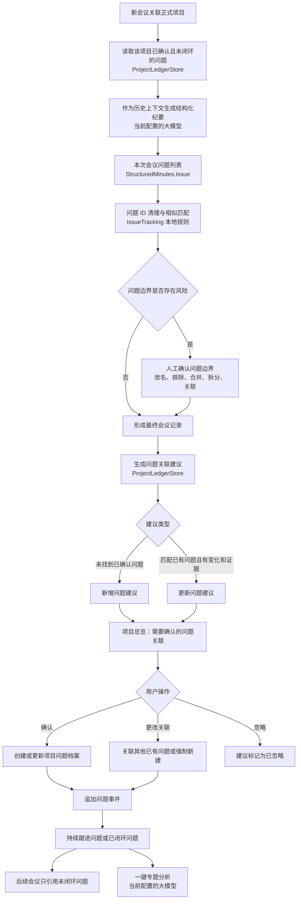
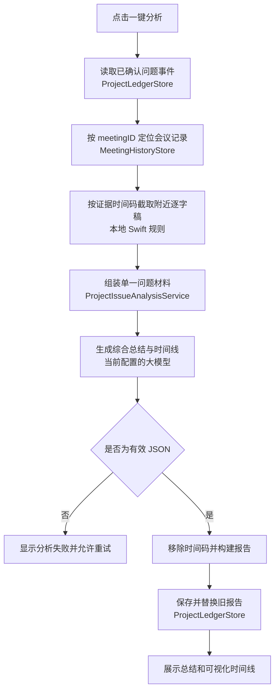
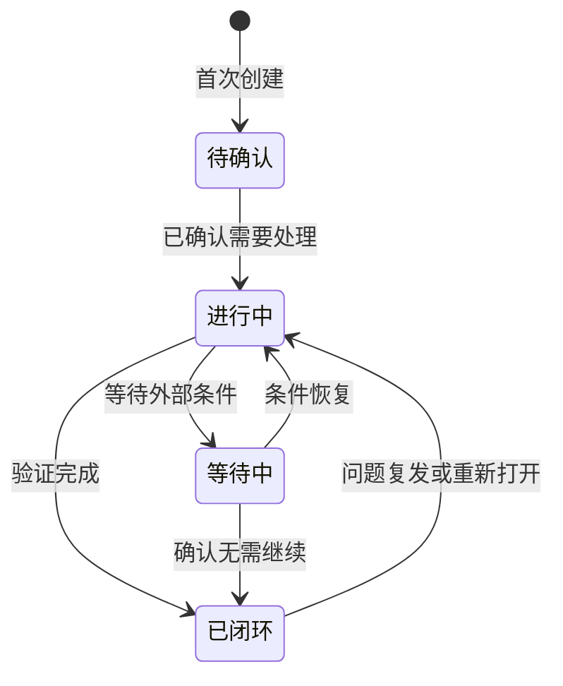

# 「项目问题」功能逻辑梳理

> 文档状态：产品梳理稿
> 梳理日期：2026-09-04
> 功能范围：会议问题识别、跨会议关联、人工确认、问题档案、状态调整、撤销与专题分析
> 当前阶段：只记录现状、问题与建议，不修改产品代码。

## 1. 功能结论

「项目问题」用于把不同会议中反复讨论的同一个问题，整理为一份可持续跟踪的项目问题档案。

它不是会议纪要中“问题列表”的简单汇总，而是独立的跨会议台账：

- 模型从本次会议提取问题。
- 已确认的未闭环历史问题作为模型上下文。
- 本地规则尝试分配或匹配稳定问题 ID。
- 系统生成“新增问题”或“关联历史问题”建议。
- 用户确认后才真正创建或更新项目问题档案。
- 每次确认形成一个不可省略的历史事件。
- 问题关闭后不再自动进入后续纪要上下文。
- 专题分析只使用已经确认关联的事件和证据。

核心原则是：

> 模型负责提出问题和关联建议，用户负责确认归属，本地台账负责保存最终事实。

## 2. 前置条件

只有同时满足以下条件，会议才能生成项目问题建议：

- 会议关联了正式 `workspaceID`。
- 模型返回了有效结构化纪要。
- 结构化纪要中存在非空问题。
- 会议最终成功保存到历史资料库。

以下情况不会生成项目问题建议：

- 只有客户/项目文字分类，没有正式项目 ID。
- 模型只返回 Markdown 原文，结构化 JSON 解析失败。
- 纪要中没有问题。
- 会议在问题边界确认之前退出或放弃。

## 3. 核心数据对象

### 3.1 本次会议问题

结构化纪要中的 `StructuredMinutes.Issue`，包含：

- `trackingID`：可能关联的稳定问题 ID。
- 标题。
- 状态。
- 背景。
- 根因。
- 方案。
- 本次进展。
- 证据时间码。

它属于某个纪要版本，还不是项目问题档案。

### 3.2 问题关联建议

`ProjectIssueProposal` 表示待确认变化：

- 新增一个项目问题；或
- 把本次会议问题关联到已有问题并更新档案。

建议状态包括：

- `pending`：待确认。
- `accepted`：已确认。
- `ignored`：已忽略。

### 3.3 项目问题档案

`ProjectIssue` 是用户确认后的跨会议权威状态，包含：

- 稳定问题 ID。
- 正式项目 ID。
- 当前标题与历史别名。
- 当前背景、根因和方案。
- 当前状态。
- 创建及最近更新时间。
- 来源会议。
- 完整事件时间线。

### 3.4 问题事件

每次确认创建、更新、关闭或手动调整状态，都会形成 `ProjectIssueEvent`：

- 事件类型：创建、更新、关闭。
- 发生时间。
- 来源会议及标题。
- 前后状态。
- 当时的标题、背景、根因、方案和进展。
- 证据时间码。
- 手动调整备注。

### 3.5 问题专题分析

`ProjectIssueAnalysis` 保存：

- 一段综合总结。
- 按日期排列的变化时间线。
- 生成时间。
- 本次分析使用的问题事件 ID。

专题分析不会修改问题状态。

## 4. 总体逻辑图

## 5. 后续会议如何获得历史问题上下文

纪要生成前，系统读取当前正式项目下已经确认的项目问题，并只选择未闭环问题，最多取最近更新的一批作为提示上下文。

提供给模型的内容包括：

- 稳定问题 ID。
- 当前标题。
- 当前状态。
- 历史背景。
- 当前根因。
- 当前方案。

提示明确要求：

- 本次明确讨论旧问题时，原样返回其稳定 ID。
- 历史内容只是上下文，不代表本次再次确认。
- `progress` 只写本次新增进展。
- 未提及的问题不要输出，也不要改变状态。
- 相似但无法确定时不要强行关联。

只有人工确认过的问题进入该上下文；原始会议纪要中的未确认问题不会直接进入。

## 6. 本地问题 ID 与相似匹配

模型输出后，`IssueTracking` 在本机进一步整理：

1. 空白 `trackingID` 转为无 ID。
2. 模型返回的 ID 如果能在历史候选中找到，则保留。
3. 没有有效 ID 时，根据标题、背景、根因和方案计算相似度。
4. 最佳匹配达到阈值且与第二名差距足够大时，关联历史问题。
5. 无可靠匹配时生成新的 `MS-ISSUE-<UUID>`。
6. 清理指向不存在问题 ID 的待办关联。

相似度规则：

- 标题权重 70%。
- 背景、根因和方案权重 30%。
- 使用清理后的连续双字符集合计算 Dice 相似度。
- 最佳匹配至少 0.72。
- 与第二名至少拉开 0.12。

这一步不调用模型。

## 7. 问题边界确认

在项目问题建议生成前，系统可能要求用户确认本次纪要的问题边界。

触发条件：

- 设置要求始终确认问题；或
- 多个问题文字重叠较高；或
- 某条内容可能只是“日志不足、证据不足、无法定位”等排查限制，并非独立问题。

用户可以：

- 修改标题。
- 排除问题。
- 合并到其他问题。
- 拆分副本。
- 直接选择历史问题 ID。

确认完成后，才保存最终会议并生成项目问题建议。

## 8. 问题关联建议生成

会议保存后，`ProjectLedgerStore.prepareProposals` 遍历结构化问题。

### 新增问题建议

当 `trackingID` 没有命中已有项目问题时，生成新增建议，包含本次会议中的完整问题字段。

### 更新问题建议

命中已有问题后，只在以下任一字段变化时考虑生成：

- 标题。
- 状态。
- 非空根因发生变化。
- 非空方案发生变化。
- 本次进展非空。

更新建议还要求本次问题具有证据；没有证据则不生成更新。

未提及的历史问题不会被推断为完成，也不会生成变化建议。

## 9. 用户确认逻辑

项目总览中的待确认问题建议提供：

### 确认

- 新增建议：创建正式项目问题。
- 更新建议：更新目标问题并追加事件。
- 建议标记为已确认。

### 更改关联

用户可以：

- 搜索当前项目已有问题。
- 查看问题的历史摘要。
- 关联到选中的已有问题。
- 强制作为新问题创建。

搜索范围包括问题标题、历史别名和背景。

### 忽略

- 不创建或更新问题档案。
- 建议保留在台账中并标记为已忽略。
- 不再显示在待确认区域。

## 10. 确认后的字段更新规则

### 创建问题

- 使用建议中的 ID，缺失时生成新 ID。
- 建立当前字段状态。
- 建立第一条创建事件。

### 更新问题

- 标题总是更新。
- 标题发生变化时，把旧标题加入别名。
- 非空背景覆盖当前背景。
- 非空根因覆盖当前根因。
- 非空方案覆盖当前方案。
- 状态更新为建议状态。
- 更新时间更新为本次会议日期。
- 追加更新或关闭事件。

状态包含“完成、关闭、闭环、解决”或英文同义表达时，视为已闭环；包含“未完成、未关闭、未解决”等明确开放表达时优先视为未闭环。

## 11. 持续跟进与已闭环问题

项目总览把问题分为：

- 持续跟进问题：当前状态未被识别为关闭。
- 已闭环问题：当前状态被识别为关闭。

持续问题会：

- 展示当前背景、根因、方案和事件历史。
- 进入后续会议的模型上下文。
- 支持修改状态和一键分析。

已闭环问题会：

- 保留完整历史。
- 不再进入后续纪要的未完成问题上下文。
- 仍支持重新打开和专题分析。

## 12. 手动修改状态

用户可从问题档案执行：

- 修改状态。
- 已闭环问题重新打开。
- 添加调整原因或说明。

手动调整：

- 直接修改项目问题当前状态。
- 追加独立问题事件。
- 不修改任何原会议纪要。
- 没有会议证据时间码。
- 事件标题显示为“手动状态调整”。

## 13. 撤销并修改已确认关联

已确认建议仍可执行「撤销并修改」：

1. 找到该建议写入的问题事件。
2. 删除与该次建议匹配的事件。
3. 如果问题没有剩余事件，删除问题档案。
4. 如果还有事件，根据剩余事件重建问题当前状态。
5. 把原建议恢复为待确认。
6. 打开关联选择器，让用户重新关联或创建新问题。

这提供了确认后的纠错能力。

## 14. 删除会议后的项目问题

删除会议历史时，当前逻辑只清理指向该会议的待确认建议。

已经确认的问题事件不会删除，项目问题档案仍保留：

- 事件中的会议标题、日期、问题字段和证据仍存在。
- 专题分析读取逐字稿上下文时，会显示会议记录当前不可用。

这是“确认后的项目事实不随来源会议删除”的保留策略，需要在产品中明确说明。

## 15. 问题专题分析

点击「一键分析」后：

1. 读取该问题已经确认的全部事件。
2. 按事件时间排序。
3. 根据事件中的会议 ID 查找会议记录。
4. 根据证据时间码提取前后约 45 秒的逐字稿片段。
5. 只把这些已确认事件及局部逐字稿交给当前配置的模型。
6. 要求模型输出一段综合总结和按会议排列的简短时间线。
7. 本地解析 JSON 并移除输出中的时间码。
8. 保存分析报告及本次使用的事件 ID。

专题分析：

- 不使用未确认建议。
- 不使用同项目的无关会议。
- 不修改问题状态。
- 再次分析会覆盖该问题上一次保存的分析报告。

## 16. 专题分析逻辑图

## 17. 各节点使用的引擎

| 节点 | 引擎/组件 | 执行位置 | 是否调用模型 |
|---|---|---|---:|
| 历史问题注入纪要 | `IssueTracking.promptContext` | 本机 | 否 |
| 本次问题提取 | 当前配置的纪要模型 | CLI 或远程 API | 是 |
| 相似匹配与 ID 分配 | `IssueTracking`、Dice 相似度 | 本机 | 否 |
| 问题边界风险检查 | `IssuePreflight` | 本机 | 否 |
| 问题边界确认 | SwiftUI | 本机 | 否 |
| 关联建议生成 | `ProjectLedgerStore.prepareProposals` | 本机 | 否 |
| 确认、忽略与撤销 | `ProjectLedgerStore` | 本机 | 否 |
| 状态关闭判断 | `WorkspaceInsights.isClosed` 文本规则 | 本机 | 否 |
| 项目问题持久化 | Foundation JSON、`project-ledger.json` | 本机 | 否 |
| 专题证据截取 | `ProjectIssueAnalysisService` 本地规则 | 本机 | 否 |
| 专题总结生成 | 当前配置的大模型 | CLI 或远程 API | 是 |
| 专题时间线展示 | SwiftUI | 本机 | 否 |

## 18. 当前做得好的地方

- 未经用户确认的问题不会进入项目权威档案。
- 只有已确认且未闭环的问题影响后续会议。
- 未提及的问题不会被推断为完成。
- 更新建议要求存在本次证据。
- 用户可以更改错误关联或强制新建。
- 已确认关联仍可撤销并重建状态。
- 每次变化保留事件历史。
- 手动状态调整不篡改原会议纪要。
- 专题分析只使用已确认的关联事件和证据上下文。
- 专题分析不自动修改问题状态。

## 19. 主要问题与风险

### 19.1 正式项目关联错误会污染问题档案

项目问题完全依赖会议的 `workspaceID`。若准备页把会议关联到错误项目，问题建议和后续历史上下文都会进入错误项目。

这是与前序“准备会议分析”共同构成的 P0 风险。

### 19.2 自动相似匹配候选包含历史会议原始问题

模型提示只读取人工确认的项目问题，但模型输出后的本地相似匹配还会查看同项目历史会议中的结构化问题。这些历史问题不一定已经人工确认进入项目台账。

可能造成：未确认的旧问题 ID 间接影响新建议。需要统一“只有已确认问题才可作为关联候选”的原则。

### 19.3 新增问题没有强制证据要求

更新已有问题必须有证据，但新增问题建议即使没有证据也会生成。用户可能确认一个没有时间码支撑的问题档案。

### 19.4 空状态可能覆盖已有状态

更新建议可能因为本次进展变化而产生，但模型返回的状态为空。用户确认后，现有问题状态可能被空值覆盖为“待确认”。

背景、根因和方案采用非空才覆盖，状态没有同样保护。

### 19.5 已关闭问题不会自动作为关联候选提供给模型

已闭环问题不进入后续纪要提示。若问题复发，模型大概率把它当作新问题；用户仍可通过「更改关联」手动关联到已关闭问题。

需要决定“复发”应新建问题还是重新打开原问题。

### 19.6 问题 ID 全局唯一性依赖约定

自动 ID 使用 UUID，正常情况下唯一。但创建问题时没有显式检查同 ID 是否已经存在；异常数据或多条尚未确认的同 ID 建议可能造成重复问题 ID。

### 19.7 删除来源会议后证据可追溯性下降

已确认事件会保留，但来源会议逐字稿可能被删除，专题分析只能看到事件摘要，无法再读取证据附近原文。

### 19.8 专题分析可能已经过期

保存报告时记录了 `sourceEventIDs`，但项目总览只要发现已有报告就显示「查看分析」，没有明显提示问题后来新增了事件、旧报告已经过期。

### 19.9 部分证据格式无法定位逐字稿

专题分析的时间解析主要支持纯 `[MM:SS]` 或 `[HH:MM:SS]`。如果证据写成“屏幕 12:34”等格式，可能无法提取逐字稿上下文。

### 19.10 关闭状态依赖自由文本判断

问题状态是自由文本，通过关键词判断是否闭环。虽然先识别“未完成、未关闭”等否定表达，但仍可能存在未覆盖的写法或误判。

### 19.11 问题与行动项的关系展示不足

结构化待办可以通过 `issueID` 指向问题，但项目问题页面没有集中展示“这个问题对应哪些行动项、当前由谁负责、是否逾期”。

## 20. 推荐问题状态机

建议将状态从自由文本逐步收敛为明确枚举，备注保留自由文本：

每次状态变化都必须追加事件，并保留备注、来源和操作者类型：会议建议或手动调整。

## 21. 推荐功能逻辑

1. 只有人工确认的项目问题参与后续模型提示和本地相似匹配。
2. 新增和更新建议都要求至少一个可验证证据；无证据建议进入“证据不足”状态。
3. 建议确认前明确展示将创建新问题还是更新哪个问题。
4. 更新时空字段默认继承历史值，不覆盖已有字段。
5. 已闭环问题复发时提供“重新打开原问题”与“作为新问题”选择。
6. 项目问题 ID 保存时强制唯一。
7. 分析报告根据事件 ID 自动判断是否过期。
8. 问题详情聚合显示其关联行动项。
9. 删除来源会议前说明对问题证据追溯的影响。

## 22. 优先级建议

### P0：归属与数据正确性

- 修复准备页可能关联错误 `workspaceID` 的问题。
- 本地相似匹配只使用人工确认的问题档案。
- 更新问题时空状态不得覆盖已有状态。
- 保存项目问题时校验 ID 唯一性。

### P1：证据与生命周期

- 新增问题也要求证据或明确标记证据不足。
- 明确已闭环问题复发规则。
- 专题分析根据 `sourceEventIDs` 标记“已过期”。
- 扩展证据时间码解析。
- 删除来源会议前提示证据追溯影响。

### P2：关系展示与可用性

- 用枚举状态替代自由文本关闭判断。
- 在问题详情展示关联行动项。
- 增加问题别名管理。
- 支持按状态、更新时间和来源会议筛选项目问题。

## 23. 验收标准

- 未关联正式项目的会议不会生成项目问题建议。
- 未经用户确认的问题不会写入项目问题档案。
- 只有已确认问题参与后续会议上下文和自动关联。
- 未提及的历史问题不会被自动关闭或改变。
- 新增和更新建议的来源会议与证据可见。
- 用户能明确选择新建问题或关联已有问题。
- 空字段不会覆盖已有有效状态和事实。
- 每次确认或手动状态调整都形成事件。
- 撤销关联后问题状态能按剩余事件正确重建。
- 问题 ID 在台账中唯一。
- 已闭环问题不进入普通未完成上下文，但复发时有明确处理方式。
- 专题分析只使用已确认事件和证据附近逐字稿。
- 新事件加入后，旧专题分析明确显示为需要更新。
- 删除来源会议前说明会失去哪些证据上下文。

## 24. 与其他功能的关联

| 关联功能 | 关联点 |
|---|---|
| 准备会议分析 | `workspaceID` 决定问题进入哪个项目 |
| 纪要生成 | 模型提取本次问题并读取已确认历史问题 |
| 问题边界确认 | 决定本次哪些问题可进入建议生成 |
| 会议资料库 | 提供来源会议、逐字稿与入口 |
| 项目行动项 | 行动项可通过 `issueID` 关联问题 |
| 项目总览 | 展示建议、问题档案、状态和专题分析 |
| 删除会议 | 待确认建议被移除，已确认事件继续保留 |
| 备份恢复 | `project-ledger.json` 保存全部问题、建议和分析 |

## 25. 待确认产品决策

1. 新增问题没有证据时，允许确认还是必须补充证据？
2. 已闭环问题再次出现时，默认重新打开还是创建复发问题？
3. 手动修改状态是否需要强制填写原因？
4. 删除来源会议时，已确认问题事件是否继续保留？
5. 项目问题状态是否改为固定选项，另设备注？
6. 问题详情是否必须展示所有关联行动项？
7. 未确认的历史会议问题是否完全禁止参与相似匹配？
8. 专题分析过期后是自动重算、提示重算，还是继续展示旧报告？
