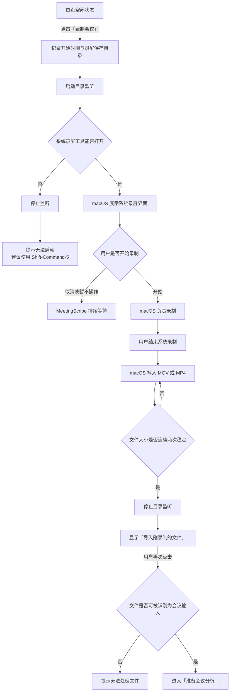
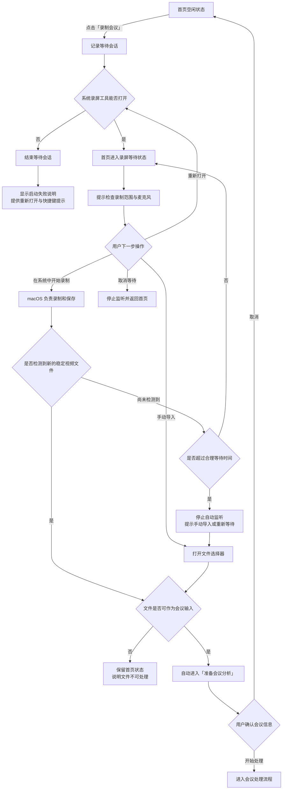

# 首页「录制会议」功能逻辑梳理

> 文档状态：产品梳理稿
> 梳理日期：2026-09-02
> 功能入口：首页 →「录制会议」
> 核心约束：必须使用 macOS 系统录屏，不在 MeetingScribe 内自行实现录制，不引入额外的屏幕录制或辅助功能权限。

## 1. 功能结论

保留「录制会议」入口，但将其定位为 **系统录屏的快捷入口与录制结果承接入口**：

- macOS 负责选择录制范围、声音来源、开始录制和结束录制。
- MeetingScribe 负责打开系统录屏工具、展示等待状态、识别录制结果并承接后续分析。
- 不通过模拟点击、键盘脚本或辅助功能权限自动操作系统录屏。
- 录制结束并识别成功后，建议自动进入「准备会议分析」，取消当前额外的“导入刚录制的文件”点击。

产品原则可概括为：

> 系统负责稳定录制，MeetingScribe 负责无缝接回。

## 2. 用户目标

用户希望从 MeetingScribe 发起一次会议录制，并在会议结束后顺畅进入纪要分析，不需要自行寻找录屏文件再手动导入。

## 3. 功能边界

### MeetingScribe 负责

- 打开 macOS 系统截屏与录屏工具。
- 记录本次等待开始时间和系统录屏保存目录。
- 展示“等待系统录制完成”的明确状态。
- 允许用户取消等待。
- 检测本次新生成且已写入完成的录屏文件。
- 检测成功后自动进入会议准备页。
- 未检测成功时提供手动导入和故障说明。

### macOS 系统负责

- 屏幕录制权限。
- 录制范围选择。
- 麦克风和其他系统录屏选项。
- 开始、停止和编码录屏。
- 录屏文件的保存位置与文件生成。

### 明确不做

- MeetingScribe 内置 ScreenCaptureKit 录制器。
- 自动模拟用户点击系统录屏按钮。
- 申请辅助功能权限控制系统录屏界面。
- 绕过系统授权或替用户隐式开始录制。
- 承诺 MeetingScribe 能控制系统录屏中的声音来源。

## 4. 当前实现

当前功能链路如下：

1. 用户点击「录制会议」。
2. MeetingScribe 开始监听系统录屏保存目录。
3. MeetingScribe 打开 macOS 系统截屏工具。
4. 用户在系统界面中选择录制范围、检查麦克风等设置并开始录制。
5. 用户通过系统方式结束录制。
6. macOS 将 MOV 或 MP4 文件保存至系统截屏保存目录。
7. MeetingScribe 每两秒检查一次目录。
8. 同一个候选文件连续两次检查大小不变后，视为写入完成。
9. 首页出现「导入刚录制的 xxx.mov」。
10. 用户点击后进入「准备会议分析」。

当前入口实现位于 `MeetingScribe/Views/ContentView.swift`，文件检测逻辑位于 `MeetingScribe/Support/SystemRecordingMonitor.swift`。

## 5. 当前功能逻辑图

## 6. 主要问题与风险

### 6.1 按钮名称与实际能力存在认知偏差

「录制会议」容易让用户理解为点击后由 MeetingScribe 直接开始录制。实际行为是打开 macOS 系统录屏工具，仍需用户在系统界面中开始录制。

建议在按钮附近增加说明，不一定必须改掉按钮名称：

> 使用 macOS 系统录屏，结束后自动导入。

如果希望名称本身更加准确，可考虑「使用系统录屏」。

### 6.2 取消路径没有闭环

用户打开系统工具但没有开始录制，或开始前取消后，MeetingScribe 会持续显示“等待系统录制完成”。当前没有取消等待或自动超时机制。

风险：

- 用户不知道如何恢复首页正常状态。
- 监听长期存在。
- 以后进入该目录的其他视频可能被误认为本次会议录屏。

### 6.3 缺少声音检查提示

MeetingScribe 不控制系统录屏的声音设置。如果用户没有正确选择麦克风或录屏结果中没有会议声音，可能在整场会议结束后才发现无法有效转录。

建议在等待提示中明确说明：

> 请在系统录屏工具中确认录制范围和麦克风设置，再点击系统的“录制”。

说明应避免承诺一定能够录到系统声音，因为声音能力和设置由 macOS 系统录屏负责。

### 6.4 文件可能被误识别

当前候选文件判定条件主要是：

- 位于系统录屏保存目录。
- 扩展名为 MOV 或 MP4。
- 创建或修改时间晚于本次等待开始时间。
- 文件大小连续两次检查保持不变。

因此，同期出现在该目录的其他视频也可能被识别。

### 6.5 保存位置变化可能导致漏检

监听目录在点击「录制会议」时确定。如果用户随后在系统录屏工具中改变保存位置，本次监听可能仍停留在原目录，导致无法发现结果。

### 6.6 完成后的确认步骤重复

当前路径包含三次用户动作：

> 录制会议 → 导入刚录制的文件 → 开始处理

其中第二次点击价值有限。文件识别成功后可自动进入准备页，由准备页承担最终确认职责。

## 7. 推荐功能逻辑

### 7.1 默认流程

1. 用户点击「录制会议」。
2. MeetingScribe 打开 macOS 系统录屏工具。
3. 首页立即切换为录屏等待状态。
4. 用户在系统工具中选择范围、确认麦克风并开始录制。
5. 用户结束系统录制。
6. MeetingScribe 检测录屏文件是否写入完成。
7. 检测成功后自动进入「准备会议分析」。
8. 用户确认会议名称、项目和材料后开始处理。

### 7.2 等待状态应提供

- 状态文案：“等待系统录制完成”。
- 操作说明：“请在系统工具中选择范围并开始录制，结束后将自动导入。”
- 「取消等待」。
- 「重新打开系统录屏」。
- 「手动导入录屏」。

### 7.3 推荐功能逻辑图

## 8. 状态定义

| 状态 | 用户可见反馈 | 可用操作 | 退出条件 |
|---|---|---|---|
| 空闲 | 显示「录制会议」 | 录制会议、导入会议 | 点击录制或导入 |
| 正在打开系统工具 | 简短加载状态 | 暂无 | 打开成功或失败 |
| 等待系统录制 | 等待提示和操作说明 | 取消、重新打开、手动导入 | 检测成功、取消或超时 |
| 已检测文件 | 可短暂显示文件名 | 自动进入准备页 | 文件校验结束 |
| 检测失败 | 显示可理解的原因 | 手动导入、重新等待、返回首页 | 用户选择后续动作 |
| 准备会议 | 展示会议名称、项目和材料 | 开始处理、取消 | 开始处理或取消 |

## 9. 异常与边界处理

| 场景 | 推荐处理 |
|---|---|
| 系统录屏工具无法打开 | 停止监听，提示使用 `Shift–Command–5`，提供重试 |
| 用户打开系统工具后取消 | 用户可点击「取消等待」立即回到首页 |
| 用户长时间未开始或未结束 | 超过合理时间后停止自动监听，保留手动导入入口 |
| 用户改变系统录屏保存位置 | 提示手动导入；后续可评估监听期间重新读取系统保存目录 |
| 同目录出现多个新视频 | 不静默选择；优先选择最新稳定文件，存在歧义时让用户确认 |
| 检测到无法解析的视频 | 不进入准备页，说明原因并提供重新选择文件 |
| 文件仍在写入 | 继续等待，不把未完成文件交给分析管道 |
| 用户在等待时手动导入其他会议 | 终止当前等待会话，避免稍后出现陈旧录屏提示 |
| 应用退出 | 结束本次监听；下次启动不自动认领未知视频 |

## 10. 文案建议

### 首页按钮

推荐保留：

> 录制会议

辅助说明：

> 使用 macOS 系统录屏，结束后自动导入。

如果不增加辅助说明，则建议将按钮改为：

> 使用系统录屏

### 等待状态

标题：

> 等待系统录制完成

说明：

> 请在系统录屏工具中选择录制范围并确认麦克风设置。结束录制后，MeetingScribe 将自动进入会议准备。

操作：

- 取消等待
- 重新打开系统录屏
- 手动导入录屏

### 超时或未检测到文件

> 暂未发现新的系统录屏。录屏可能保存到了其他位置，你可以手动选择文件，或重新等待。

## 11. 优先级建议

### P0：补齐基本闭环

- 增加「取消等待」。
- 等待状态补充录制范围和麦克风提醒。
- 用户改为手动导入其他文件时，停止当前录屏监听。
- 系统工具启动失败时确保监听结束。

### P1：减少操作与误判

- 检测成功后自动进入准备页。
- 增加合理的等待超时及恢复入口。
- 多个候选文件存在时让用户确认。

### P2：增强兼容性

- 监听期间重新检查系统录屏保存目录。
- 改善录屏文件来源识别。
- 增加针对目录变化、多文件和超时状态的测试。

## 12. 验收标准

- 点击「录制会议」能够打开 macOS 系统录屏工具。
- MeetingScribe 不申请辅助功能权限，也不自动模拟系统界面操作。
- 系统工具启动失败后，不保留后台监听状态。
- 等待状态明确说明下一步，并允许用户取消。
- 取消等待后，新出现的视频不会被认领为本次录屏。
- 录屏文件写入完成前不会进入后续流程。
- 成功识别录屏后自动进入会议准备页。
- 用户手动导入其他会议时，原录屏等待会话自动结束。
- 未检测到文件时，用户始终可以手动导入。
- 存在多个合理候选文件时，不静默选择错误文件。

## 13. 待确认产品决策

1. 首页按钮继续使用「录制会议」，还是改为「使用系统录屏」？
2. 自动等待多长时间后进入“未检测到文件”状态？
3. 检测到唯一候选文件后直接进入准备页，还是短暂提示文件名后再进入？
4. 同时出现多个候选文件时，是弹出选择列表，还是统一引导手动导入？
5. 准备页取消后，是返回首页并保留该录屏快捷入口，还是完全结束本次录制会话？
